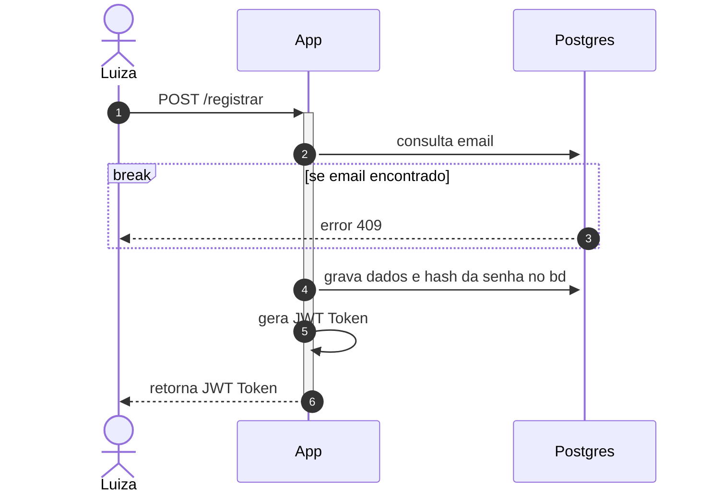
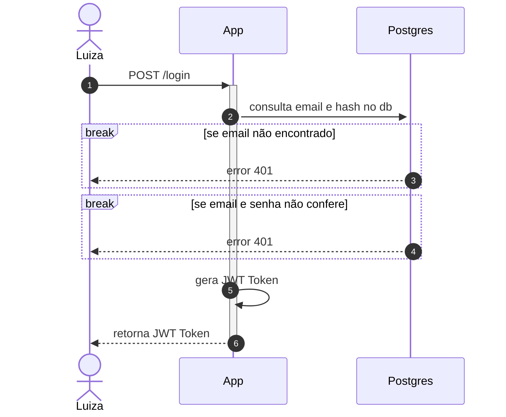
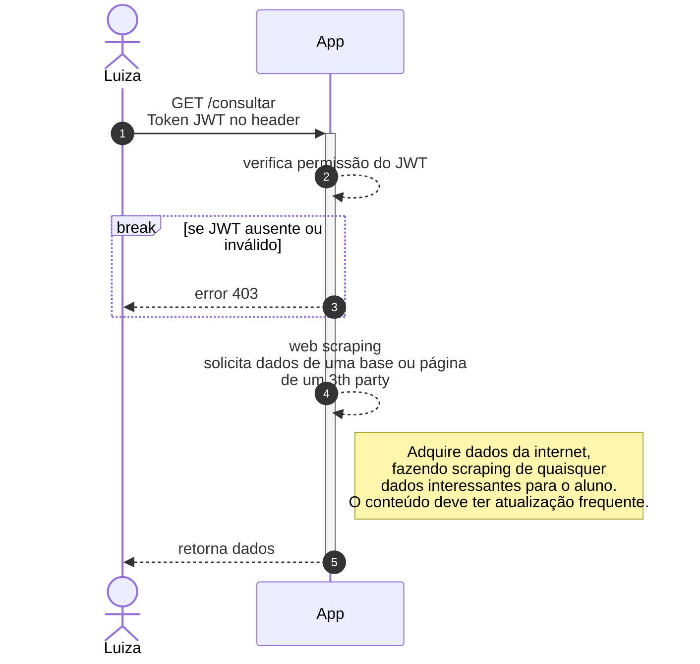
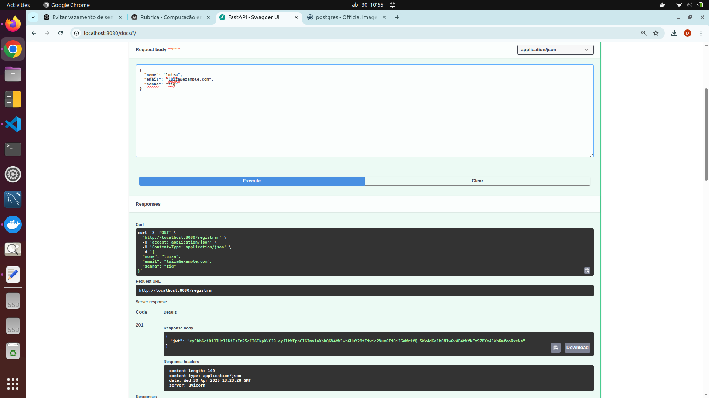
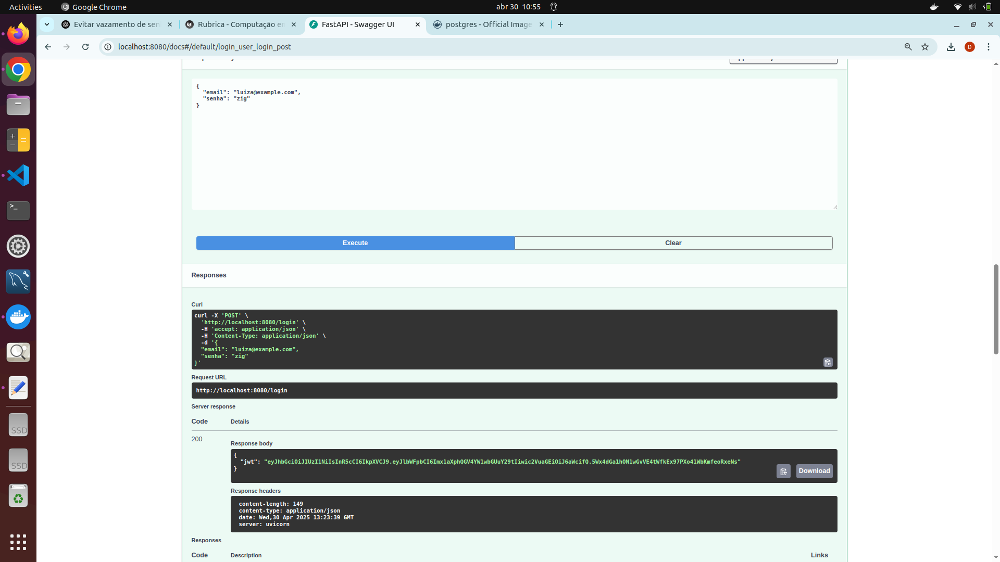
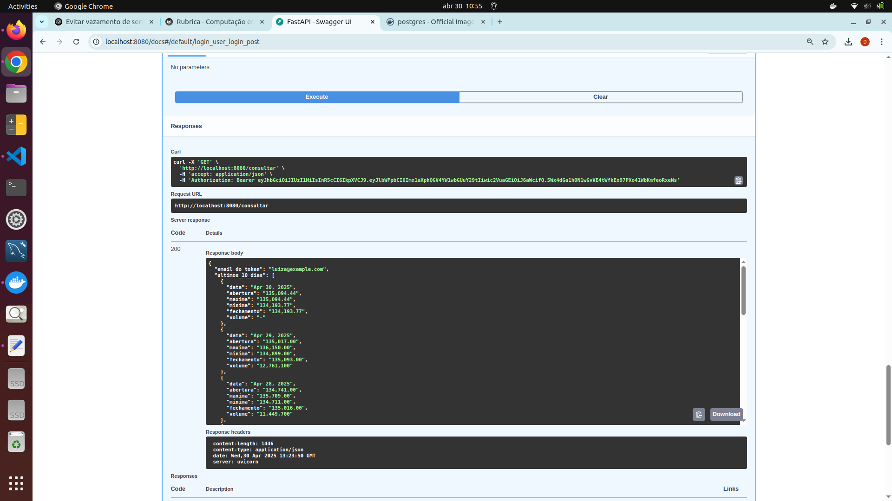

# Relatório Completo do Projeto – API FastAPI + Scraper IBOVESPA

---

## Etapa 1 - Construção da API

Nesta primeira etapa projeto criamos uma API em FastAPI que:

- Registra e autentica usuários via JWT.  
- Faz scraping do histórico de preços do índice IBOVESPA (Yahoo Finance).  
- Retorna os últimos 10 dias como JSON protegido por token.

Para isso temos **3 endpoints**:

### 1. POST/registrar 

* **Função**: registrar um novo usuário.  
* **Campos de entrada**:  
    - `nome` (string)  
    - `email` (string, formato email)  
    - `senha` (string) 
* **Validação**: verifica no banco se o email já está cadastrado. 
* **Saída**: um JSON contendo o JWT (token).

**Body**:
```json
{ "nome": "Seu Nome", "email": "email@exemplo.com", "senha": "123456" }
```


**Resposta**:
```json
{ "jwt": "eyJ0eXAiOiJK..." }
```

Segue esquema do endpoint POST/registrar





### 2. POST/login 

* **Função**: autenticar usuário já registrado.
* **Campos de entrada**:  
    - `email` (string, formato email)  
    - `senha` (string) 
* **Validação**: Checa se email foi registrado e busca senha_hash no banco e compara com a senha informada.
* **Saída**: um JSON contendo o JWT (token).

**Body**:
```json
{ "email": "email@exemplo.com", "senha": "123456" }
```

**Resposta**:
```json
{ "jwt": "eyJ0eXAiOiJK..." }
```

Segue esquema do endpoint POST/login




### 3. GET/consultar 

* **Função**: autenticar usuário já registrado.
* **Autorização**: precisa do header 
```
Authorization: Bearer <seu_jwt_aqui>
```
	* No cadeado acima do "Try it out" é necessário colocar o token e autorizar, depois é só rodar o execute!!

* **Processo**:
	1. Decodifica o JWT e valida o token.

	2. Faz scraping da página do Yahoo Finance.

	3. Extrai data, abertura, máxima, mínima, fechamento e volume.

* **Saída**: JSON com a lista de 10 dias do IBOVESPA.
	
**Resposta**:
```json
{"ultimos_10_dias": [ { "data":"...", "abertura":"...", … }, … ]}
```

Segue esquema do endpoint GET/consultar




# Explicação do passo a passo

1. Primeiro formatamos o repositório e todos os arquivos.

2. Definimos os models: UserCreate e UserLogin 

3. Segurança e Autenticação : Garantimos que quando o usuário colocasse sua senha que ela fosse transformada em um hash.

4. Extração de Dados – Scraper IBOVESPA  
    - **Requisições HTTP**: usamos `requests` com `User-Agent` padrão.
    - **Parsing com BeautifulSoup**: localizamos o `<tbody>` da tabela histórica via seletor CSS (Inspect) do site do Yahoo Finance e extraímos data, abertura, máxima, mínima, fechamento e volume para os 10 primeiros registros do IBOVESPA.  

5. Dockerização e Orquestração  
    - **Dockerfile**: configuramos imagem leve (Python slim), instalamos dependências e expomos a aplicação na porta 8080.  

#Teste dos ENDPOINTS


///caption
POST/registrar
///


///caption
POST/login
///


///caption
GET/consultar
///

#Link para Vídeo

[https://youtu.be/Dt5RYUkA8l8](https://youtu.be/Dt5RYUkA8l8)

#Link para docker hub

[https://hub.docker.com/repository/docker/luizatac/projeto_cloudi-app/general](https://hub.docker.com/repository/docker/luizatac/projeto_cloudi-app/general)

#Mapa do repositório

```
projeto-cloudi-app/
├── api/
│   ├── app/              
│   │   └── app.py
│   ├── .env              
│   ├── Dockerfile         
│   └── requirements.txt
├── compose.yaml           ⟵ arquivo compose.yaml
├── .gitignore
└── README.md 
```

Segue abaixo arquivo **compose.yaml FINAL** do projeto:

``` { .yaml title="compose.yaml" }
    services:
  app:
    image: luizatac/projeto_cloudi-app:cloudi
    container_name: app
    env_file: .env
    environment:
      - POSTGRES_DB=${POSTGRES_DB}
      - POSTGRES_USER=${POSTGRES_USER}
      - POSTGRES_PASSWORD=${POSTGRES_PASSWORD}
      - JWT_SECRET_KEY=${JWT_SECRET_KEY}
      - DB_HOST=database
    ports:
      - "8080:8080"
    depends_on:
      - database

  database:
    image: postgres:17
    container_name: database
    env_file: .env                 
    environment:
      POSTGRES_USER: ${POSTGRES_USER}
      POSTGRES_PASSWORD: ${POSTGRES_PASSWORD}
      POSTGRES_DB: ${POSTGRES_DB}
    ports:
      - "5432:5432"

```


