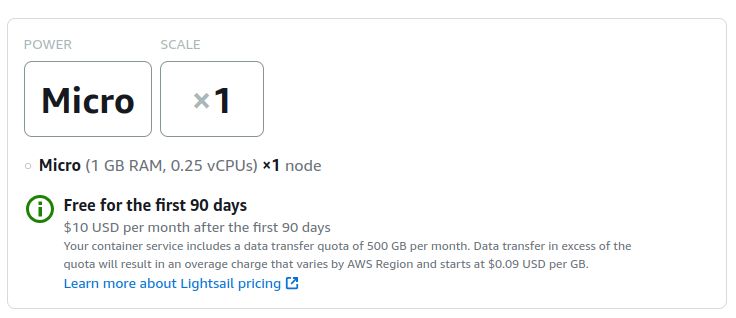
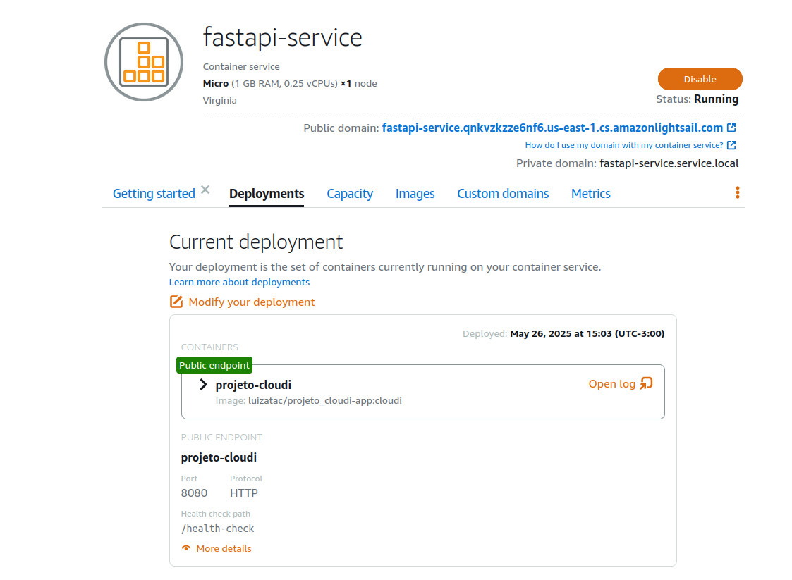
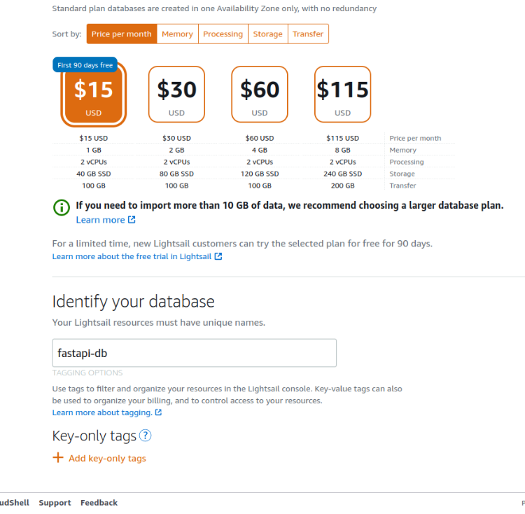
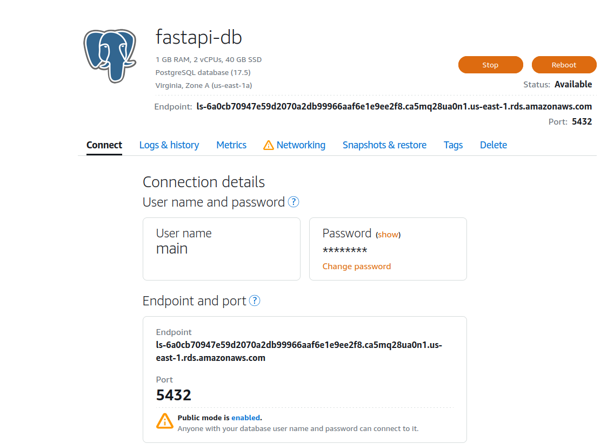
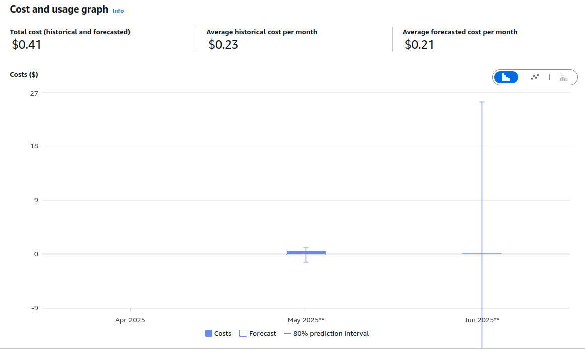
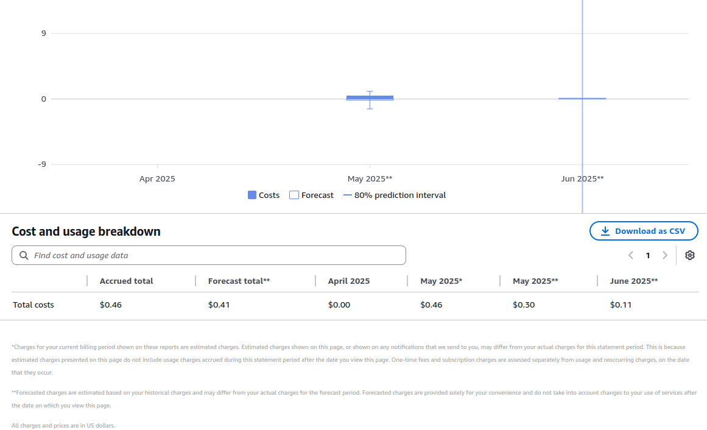
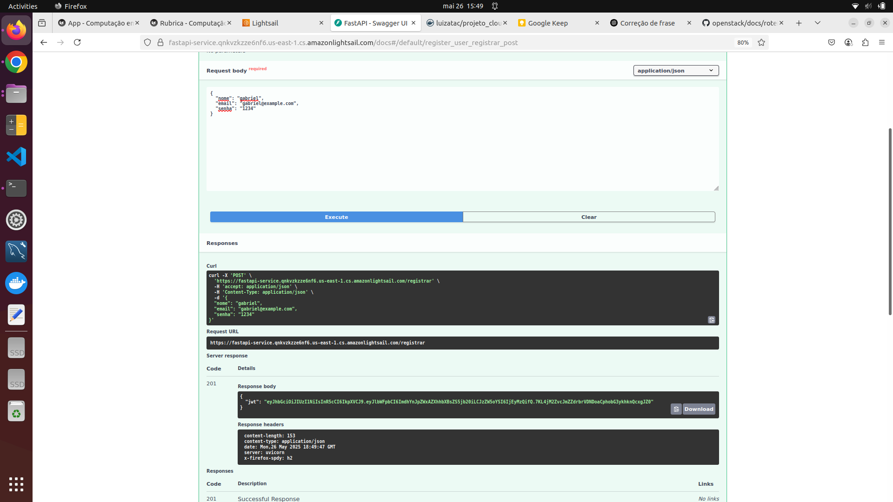
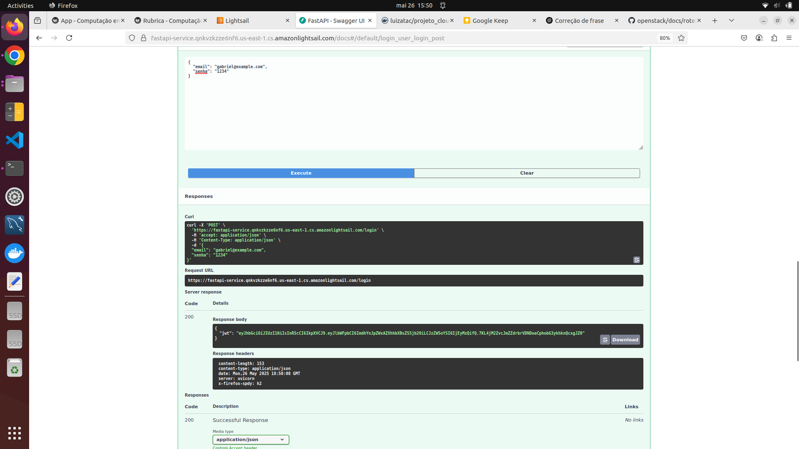
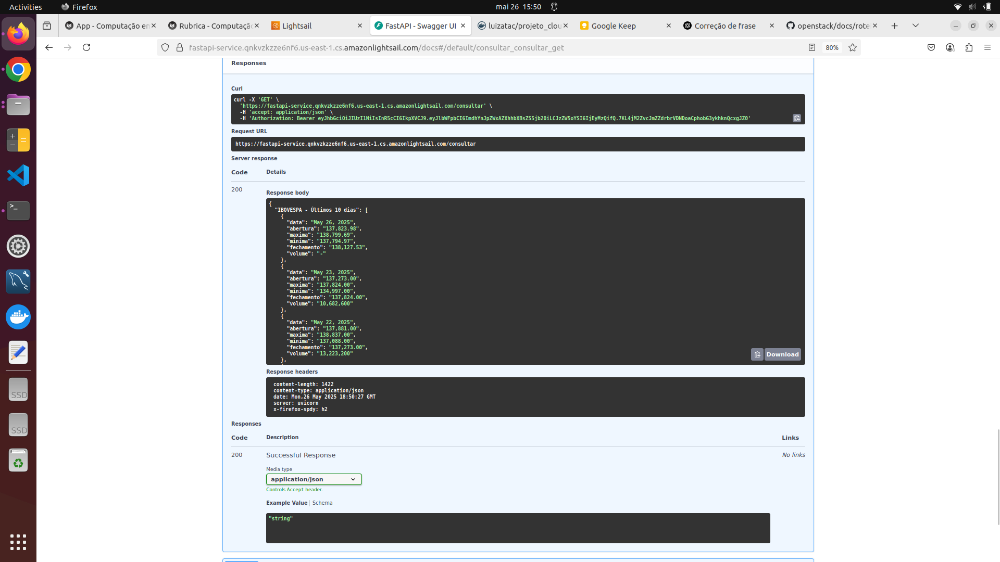
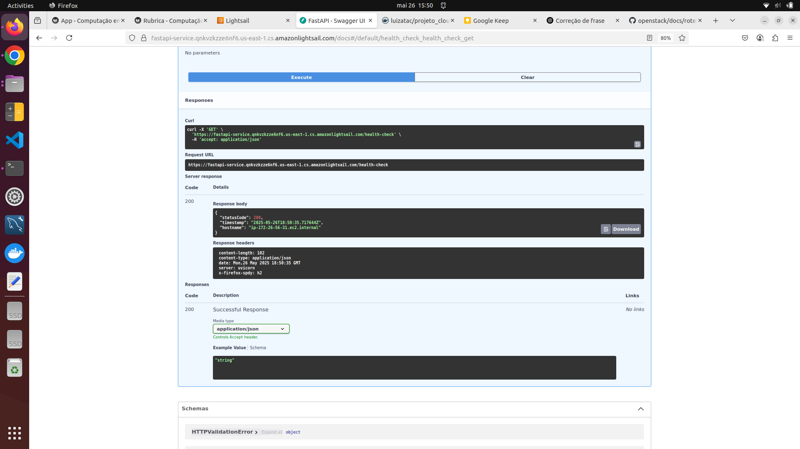

# Relatório do Projeto – API FastAPI + Scraper IBOVESPA + AWS Lightsail

---

## Etapa 1 - Construção da API

Nesta primeira etapa do projeto criamos uma API em FastAPI que:

- Registra e autentica usuários via JWT.  
- Faz scraping do histórico de preços do índice IBOVESPA (Yahoo Finance).  
- Retorna os últimos 10 dias como JSON protegido por token.

Para isso temos **4 endpoints**:


???+ note "1. POST/registrar"
    * **Função**: registrar um novo usuário.  
    * **Campos de entrada**:  
        - `nome` (string)  
        - `email` (string, formato email)  
        - `senha` (string) 
    * **Validação**: verifica no banco se o email já está cadastrado. 
    * **Saída**: um JSON contendo o JWT (token).

    **Body**:
    ```json
    { "nome": "Seu Nome", "email": "email@exemplo.com", "senha": "123456" }
    ```


    **Resposta**:
    ```json
    { "jwt": "eyJ0eXAiOiJK..." }
    ```

    Segue esquema do endpoint POST/registrar


    ``` mermaid
        sequenceDiagram
            autonumber
            actor Luiza
            Luiza->>+App: POST /registrar
            App->>+Postgres: consulta email
            break se email encontrado
                Postgres-->>Luiza: error 409
            end
            App->>Postgres: grava dados e hash da senha no bd
            App->>App: gera JWT Token
            App-->>-Luiza: retorna JWT Token
    ```


???+ note "2. POST/login" 

    * **Função**: autenticar usuário já registrado.
    * **Campos de entrada**:  
        - `email` (string, formato email)  
        - `senha` (string) 
    * **Validação**: Checa se email foi registrado e busca senha_hash no banco e compara com a senha informada.
    * **Saída**: um JSON contendo o JWT (token).

    **Body**:
    ```json
    { "email": "email@exemplo.com", "senha": "123456" }
    ```

    **Resposta**:
    ```json
    { "jwt": "eyJ0eXAiOiJK..." }
    ```

    Segue esquema do endpoint POST/login

    ``` mermaid
        sequenceDiagram
            autonumber
            actor Luiza
            Luiza->>+App: POST /login
            App->>+Postgres: consulta email e hash no db
            break se email não encontrado
                Postgres-->>Luiza: error 401
            end
            break se email e senha não confere
                Postgres-->>Luiza: error 401
            end
            App->>App: gera JWT Token
            App-->>-Luiza: retorna JWT Token
    ```


???+ note "3. GET/consultar"

    * **Função**: autenticar usuário já registrado.
    * **Autorização**: precisa do header 
    ```
    Authorization: Bearer <seu_jwt_aqui>
    ```
        * No cadeado acima do "Try it out" é necessário colocar o token e autorizar, depois é só rodar o execute!!

    * **Processo**:
        1. Decodifica o JWT e valida o token.

        2. Faz scraping da página do Yahoo Finance.

        3. Extrai data, abertura, máxima, mínima, fechamento e volume.

    * **Saída**: JSON com a lista de 10 dias do IBOVESPA.
        
    **Resposta**:
    ```json
    {"ultimos_10_dias": [ { "data":"...", "abertura":"...", … }, … ]}
    ```

    Segue esquema do endpoint GET/consultar

    ``` mermaid
        sequenceDiagram
            autonumber
            actor Luiza
            Luiza->>+App: GET /consultar <br> Token JWT no header
            App-->>App: verifica permissão do JWT
            break se JWT ausente ou inválido
                App-->>Luiza: error 403
            end
            App-->>App: web scraping<br>solicita dados de uma base ou página<br>de um 3th party
            Note right of App: Adquire dados da internet, <br>fazendo scraping de quaisquer<br> dados interessantes para o aluno.<br>O conteúdo deve ter atualização frequente.
            App-->>-Luiza: retorna dados
    ```

???+ note "4. GET /health-check"
    * **Função**: verificar se a aplicação está rodando (AWS Lightsail)
    * **Saída**: status code 200.

    **Resposta**:
    ```json
        {
        "statusCode": 200,
        "timestamp": "2024-09-16T12:00:00Z",
        "hostname": "ip-172-16-0-12" 
        }
    ```

### Explicação do passo a passo

1. Primeiro formatamos o repositório e todos os arquivos.

2. Definimos os models: UserCreate e UserLogin 

3. Segurança e Autenticação : Garantimos que quando o usuário colocasse sua senha que ela fosse transformada em um hash.

4. Extração de Dados – Scraper IBOVESPA  
    - **Requisições HTTP**: usamos `requests` com `User-Agent` padrão.
    - **Parsing com BeautifulSoup**: localizamos o `<tbody>` da tabela histórica via seletor CSS (Inspect) do site do Yahoo Finance e extraímos data, abertura, máxima, mínima, fechamento e volume para os 10 primeiros registros do IBOVESPA.  

5. Dockerização e Orquestração  
    - **Dockerfile**: configuramos imagem leve (Python slim), instalamos dependências e expomos a aplicação na porta 8080.  

###Teste dos ENDPOINTS


///caption
POST/registrar
///


///caption
POST/login
///


///caption
GET/consultar
///

!!! danger "Atenção"

    **O quarto endpoint foi adicionado após a realização da primeira etapa, portanto seu teste foi feito direto na segunda etapa!!**

###Link para Vídeo

[https://youtu.be/Dt5RYUkA8l8](https://youtu.be/Dt5RYUkA8l8)

###Link para docker hub

[https://hub.docker.com/repository/docker/luizatac/projeto_cloudi-app/general](https://hub.docker.com/repository/docker/luizatac/projeto_cloudi-app/general)

###Mapa do repositório

```
projeto-cloudi-app/
├── api/
│   ├── app/              
│   │   └── app.py
│   ├── .env              
│   ├── Dockerfile         
│   └── requirements.txt
├── compose.yaml           ⟵ arquivo compose.yaml
├── .gitignore
└── README.md 
```

Segue abaixo arquivo **compose.yaml FINAL** do projeto:

``` { .yaml title="compose.yaml" }
    services:
  app:
    image: luizatac/projeto_cloudi-app:cloudi
    container_name: app
    env_file: .env
    environment:
      - POSTGRES_DB=${POSTGRES_DB}
      - POSTGRES_USER=${POSTGRES_USER}
      - POSTGRES_PASSWORD=${POSTGRES_PASSWORD}
      - JWT_SECRET_KEY=${JWT_SECRET_KEY}
      - DB_HOST=database
    ports:
      - "8080:8080"
    depends_on:
      - database

  database:
    image: postgres:17
    container_name: database
    env_file: .env                 
    environment:
      POSTGRES_USER: ${POSTGRES_USER}
      POSTGRES_PASSWORD: ${POSTGRES_PASSWORD}
      POSTGRES_DB: ${POSTGRES_DB}
    ports:
      - "5432:5432"

```

--------------

## Etapa 2 - Projeto FastAPI no AWS Lightsail

Nesta segunda etapa do projeto :

- Implantamos a aplicação FastAPI utilizando o AWS Lightsail Container Service.  
- Configuramos um banco de dados PostgreSQL gerenciado no Lightsail.
- Conectamos a aplicação ao banco de dados.
- Gerenciamos e monitorams o custo do serviço em produção.


### Criando container no Lightsail

- **Service name:** fastapi-service
- **Power:** Micro
- **Scale:** Número de instâncias = 1


///caption
Container service capacity
///



///caption
Confirmação de container funcionando
///
    
### Criando database no Lightsail

- **Database engine:** PostgreSQL
- **Database name:** fastapi-db
- **Master username:** main
- Ativando public mode


///caption
Database capacity
///



///caption
Confirmação de database funcionando
///


### Tabela de custos do projeto


///caption
Mapa de custos do projeto no site AWS
///



///caption
Tabela de custos do projeto no site AWS
///

!!! info "Custos"
    Após as definições de capacidade e tamanho temos : $10 USD por mês para o Container e $ 15 USD por mês para o Database. Resultando em aproximadamente $25 USD mensais, não sobressaltando o limite mensal de $ 50 USD.


### Testando Endpoints na infraestrutura da AWS


///caption
POST/registrar
///



///caption
POST/login
///


///caption
GET/consultar
///



///caption
GET/health-check
///

### Explicação do passo a passo

**1. Acesso e configuração inicial na AWS**

Acessamos a conta da AWS fornecida pelaequipe e utilizamos o serviço IAM para criar um novo usuário com permissões específicas para gerenciar os recursos no Lightsail (Containere Database).

**2.  Criação e configuração do container no Lightsail**

No console do Lightsail, criamos um container, definindo as portas necessárias, a imagem do Docker hospedada no DockerHub e adicionando as variáveis de ambiente que estavam previamente no arquivo .env do projeto.

**3. Criação e configuração do banco de dados no Lightsail**

Em seguida, configuramos uma instância de banco de dados (PostgreSQL), definindo nome de usuário, senha, nome do banco e liberando o acesso externo para testes (Public mode).

**4. Adaptação da aplicação para rodar no container AWS**

Ajustamos o projeto para funcionar corretamente no ambiente da AWS, aproveitando a imagem já existente no DockerHub e garantindo que as variáveis de ambiente estavam corretamente passadas para o container via painel do Lightsail.

**5. Testes dos endpoints via Swagger e acesso ao banco**

Após o container estar rodando, testamos os endpoints da API utilizando o Swagger para validar o funcionamento da aplicação. Também acessamos o banco de dados via terminal, utilizando as credenciais e endpoint fornecidos pelo Lightsail,utilizando os seguintes comandos:


<!-- termynal -->
```bash
sudo apt install postgresql-client-common
sudo apt-get install postgresql-client
``` 

* Entrando no nosso banco usando o **Endpoint, User e Database name** :


<!-- termynal -->
```bash
psql -h ls-6a0cb70947e59d2070a2db99966aaf6e1e9ee2f8.ca5mq28ua0n1.us-east-1.rds.amazonaws.com -U main -d dbfastapi
``` 

* Após entrar no banco de dados, utilizamos o seguinte comando para visualizar todos os usuários da nossa tabela _users_ :

```bash
SELECT * FROM users;
```


###Link para Vídeo  

[https://youtu.be/__fZo9ygJp4](https://youtu.be/__fZo9ygJp4)