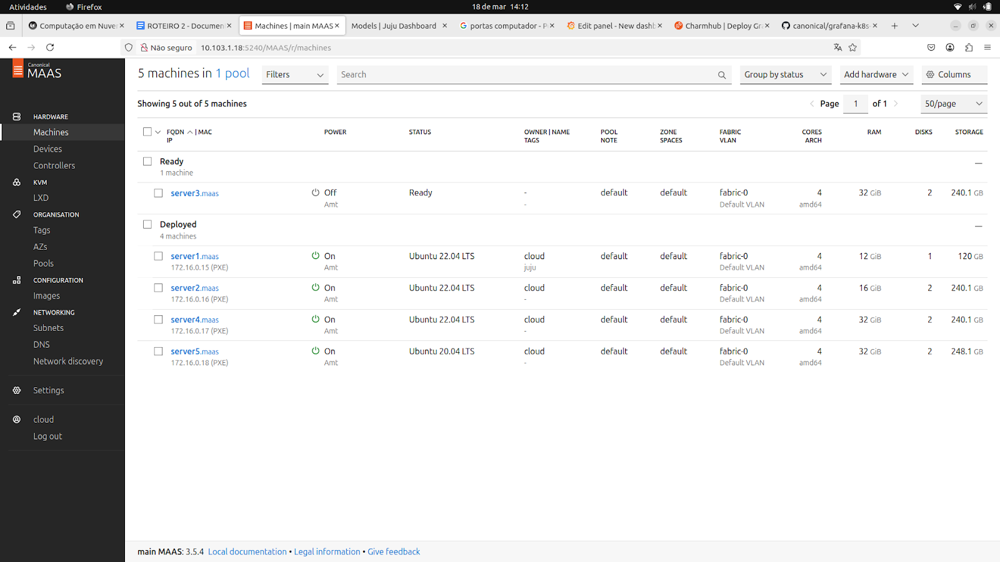
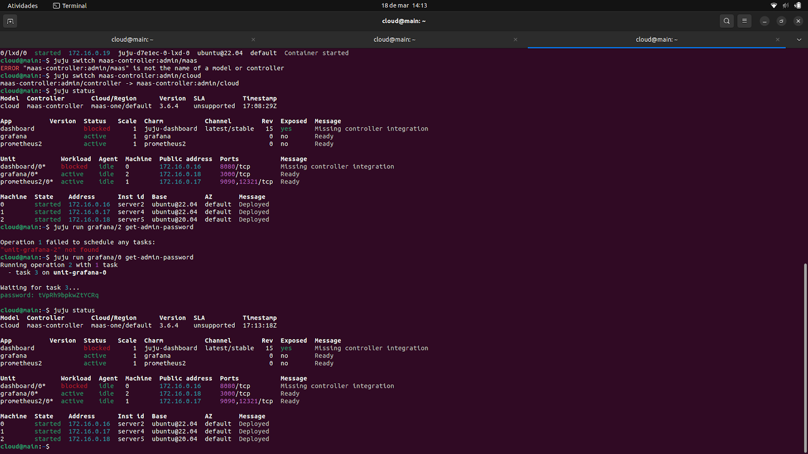
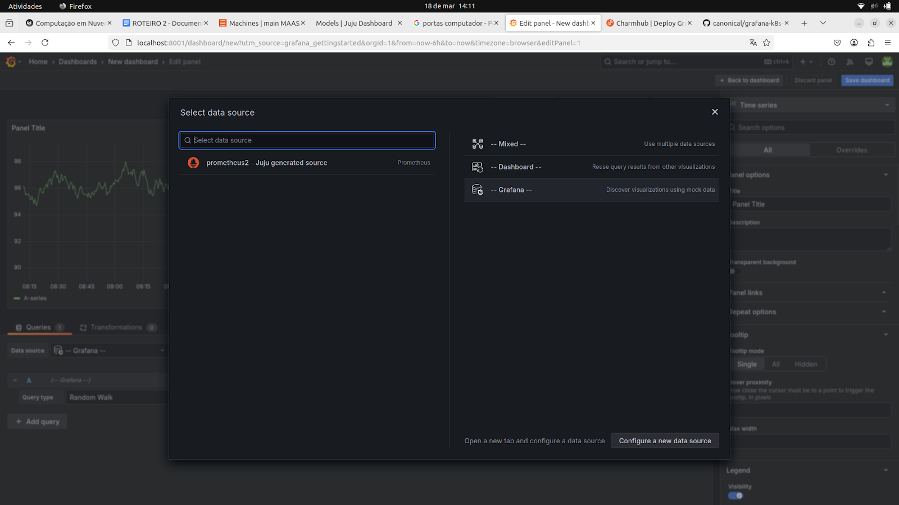
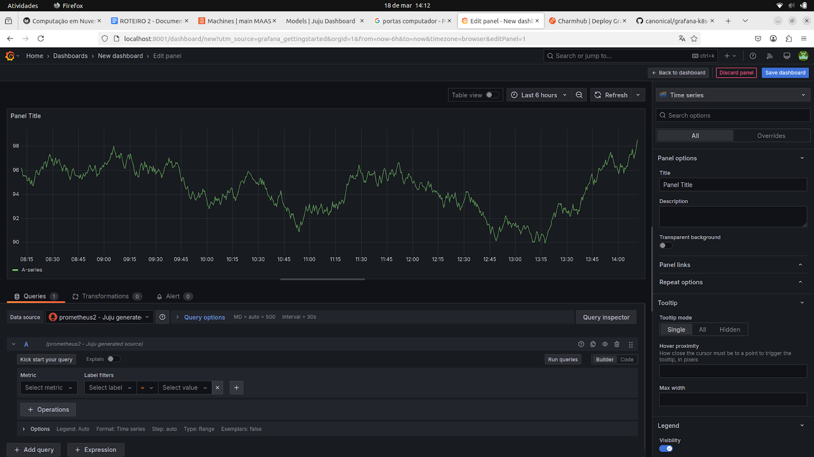
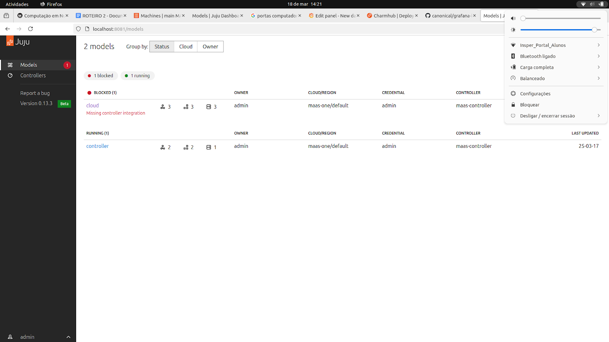
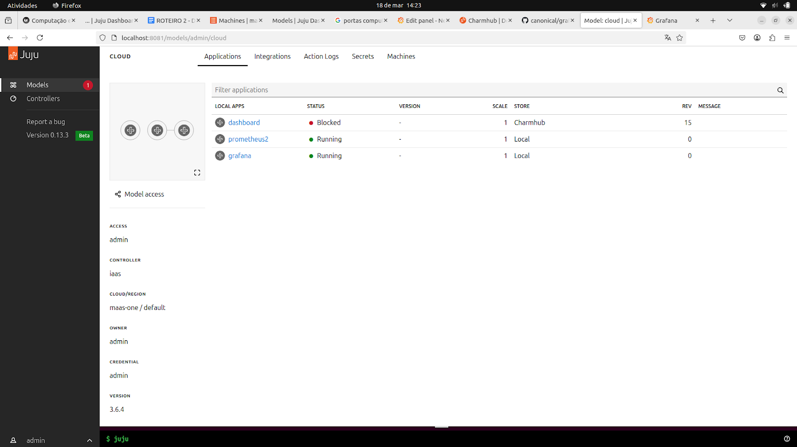

## Objetivo

O objetivo deste segundo roteiro é compreender os conceitos essenciais de uma plataforma de gerenciamento de aplicações distribuídas, nesse caso, o Juju da Canonical, explorando orquestração, escalabilidade e monitoramento. Além disso, compreender os fundamentos de comunicação entre aplicações e serviços.

## Criando a Infraestrutura para deploy com Juju

No roteiro anterior, utilizou-se o Ansible como gerenciador de deploy, lidando com a instalação e configuração de um conjunto de nós, porém, ele não consegue realizar o provisionamento direto com o MAAS. Sendo assim, nesse roteiro, será utilizado o Juju.

Primeiramente, realizou-se o release de todas as máquinas no MAAS (server1 ao server5). Com isso feito, acessou-se a máquina main, via SSH, e foi realizada a instalação do Juju, com o seguinte comando.

<!-- termynal -->
``` bash
sudo snap install juju --channel 3.6
```

Em seguida, foi realizada a verificação se o Juju estava enxergando o MAAS como um provedor de recursos, utilizando o seguinte comando.

<!-- termynal -->
``` bash
juju clouds
```

Assim como demonstra a figura a seguir, o MAAS não estava como provider do Juju.


/// caption
///

Para resolver essa questão, começou-se adicionando o cluster MAAS para que o Juju pudesse. gerenciá-lo como uma cloud. Desse modo, o Juju utilizaria o MAAS como provedor de máquinas e SO (Sistema Operacional).

Sendo assim, criou-se um arquivo de definição de cloud, o "maas-cloud.yaml", adicionando o ip da máquina main (172.16.0.3) e a porta do MAAS (5240) no endpoint, como apresentado na figura abaixo.


/// caption
maas-cloud.yaml
///

Após isso, adicionou-se a nova cloud com o seguinte comando.

<!-- termynal -->
``` bash
juju add-cloud --client -f maas-cloud.yaml maas-one
```

E o resultado está demonstrado na figura abaixo.


/// caption
///

Porém, foi necessário, após a criação, adicionar as credenciais MAAS, permitindo a interação do Juju com a nova cloud. Para tal, criou-se o arquivo "maas-creds.yaml" para importar as informações necessárias, como demonstrado abaixo.


/// caption
maas-creds.yaml
///

**Observação: O campo maas-oauth recebeu o API key gerado no MAAS e que está localizado dentro do menu de usuário.**

Em seguida, utilizou-se o seguinte comando para adicionar a credencial.

<!-- termynal -->
``` bash
juju add-credential --client -f maas-creds.yaml maas-one
```

Como mostrado na figura abaixo.


/// caption
Adicionando a credencial
///

O passo seguinte foi criar o controlador para a cloud recém-criada (maas-one). Ele foi criado no server1 utilizando a série "jammy" do Ubuntu.

Para que isso fosse possível, fez-se a tag da máquina com o nome "juju" no dashboard do MAAS (aba machines -> categorize -> new tag).


/// caption
Tag "juju" no server1
///

Tendo isso feito, o comando a seguir foi rodado.

<!-- termynal -->
``` bash
juju bootstrap --bootstrap-series=jammy --constraints tags=juju maas-one maas-controller
```

Com isso, o Juju e o Ubuntu foram instalados no server1, como é possível observar na figura abaixo.


/// caption
Server1 "deployed"
///

Por fim, criou-se um novo modelo, determinando qual o controlador que deveria ser instalado pelo Juju, nesse caso, o openstack.

Para isso, utilizou-se o comando abaixo.

<!-- termynal -->
``` bash
juju add-model --config default-series=jammy openstack
```


/// caption
Modelo criado
///

Após isso, verificou-se o status do controller com o seguinte comando.

<!-- termynal -->
``` bash
juju status
```


/// caption
Controller status
///

Todo esse processo foi responsável por alocar o server1 como o controlador de deploy para o Juju.


## APP

Antes da realização do deploy de instalações com o Juju, realizou-se a instalação do dashboard do Juju.

O Juju possui um modelo próprio de gerenciador chamado controller, que é responsável por gerenciar a própria aplicação em si.

Primeiramente, foi necessário mudar para esse modelo, usando o comando a seguir.

<!-- termynal -->
``` bash
juju switch controller
```

Após isso, criou-se uma máquina virtual no server1, pois não foi possível alocar uma máquina para o dashboard, e deu-se deploy na aplicaçãom utilizando o seguinte comando.

<!-- termynal -->
``` bash
juju deploy juju-dashboard --to lxd:0
```

/// caption
Deploy do dashboard na máquina virtual
///

Uso do Juju status para verificar se deu certo.


/// caption
///

Feito isso, criou-se um túnel para acessar a aplicação na máquina virtual, utlizando o comando a seguir.

<!-- termynal -->
``` bash
ssh cloud@10.103.1.18 -L 8081:172.16.0.19:8080
```

E conseguiu-se acessar o dashboard.


/// caption
Acesso ao dashboard
///

Após o deploy e instalação do dashboard, foram feitas as instalações do Grafana e do Prometheus. O Grafana é uma plataforma de código aberto para visualização de dados, facilitando a análise em tempo real. Ele requer um banco de dados para armazenar configurações e metadados, neste caso, decidiu-se utilizar o Prometheus.

Antes da instalação criou-se uma pasta "charms" para baixar o charm (pacote de software para automatizar a implantação, integração e gerenciamento pelo Juju) do Grafana e do Prometheus do repositório charm-hub.


/// caption
Download do Grafana e do Prometheus
///

Após isso, realizou-se o deploy de ambos com auxílio do Juju e, para isso, foram alocadas as máquinas 4 e 5, como é possível obeservar na figura abaixo.


/// caption
Deploy do Prometheus
///


/// caption
Deploy do Grafana
///

O passo seguinte foi integrar o Grafana com o Prometheus, a partir do seguinte comando.

<!-- termynal -->
``` bash
juju integrate prometheus2:grafana-source grafana:grafana-source
```

Esse comando é responsável por criar uma relação entre as duas aplicações. É importante salientar duas coisas:

- "prometheus2:grafana-source": é o endpoint que o Prometheus expõe para fornecer dados ao Grafana. Esse endpoint contém as informações necessárias para que o Grafana consiga se conectar ao Prometheus e buscar métricas.
- "grafana:grafana-source": é o endpoint que o Grafana expõe para receber dados de uma fonte externa, como o Prometheus.


/// caption
Integração do prometheus com o grafana
///

Em seguida, acessou-se o dashboard do grafana. Porém, para que isso fosse possível, foi necessário realizar um túnel na porta 8001 da máquina main e na 3000 (porta do Grafana) na máquina que foi alocada, nesse caso, o server5, logo, utilizou-se o comando abaixo.

<!-- termynal -->
``` bash
ssh cloud@10.103.1.18 -L 8001:172.16.0.18:3000
```

Desse modo, conseguiu-se acessar o Grafana.


/// caption
Acesso ao grafana
///

Para acessar o grafana, o usuário padrão é: admin. Porém, para pegar a senha foi necessário rodar o seguinte comando.

<!-- termynal -->
``` bash
juju run grafana/0 get-admin-password
```

/// caption
Senha para o grafana
///

Após a realização do acesso, a senha foi alterada para "admin".

Afim de verificar se a integração foi feita corretamente, criou-se um dashboard dentro do grafana, utilizando o prometheus como source, assim como verificado nas figuras abaixo.


/// caption
///


/// caption
Dashboard no grafana com source prometheus 
///

### Tarefa 1

1. De um print da tela do Dashboard do MAAS com as Maquinas e seus respectivos IPs.
2. De um print de tela do comando "juju status" depois que o Grafana estiver "active". 
3. De um print da tela do Dashboard do Grafana com o Prometheus aparecendo como source.
4. Prove (print) que você está conseguindo acessar o Dashboard a partir da rede do Insper.
5. De um print na tela que mostra as aplicações sendo gerenciadas pelo JUJU.

I.


/// caption 
///

II.


/// caption 
///

III.


/// caption 
///


/// caption 
///

IV.


/// caption 
///

V.


/// caption 
///