## Objetivo

O objetivo do terceiro roteiro é entender os conceitos básicos de private cloud e aprofundar os conceitos sobre redes virtuais SDN. Para isso, o roteiro foi dividido em três partes principais, a criação da infraestrutura (nuvem privada Openstack), a configuração da infraestrutura e o uso da mesma (aplicações nas VMs da Nuvem Openstack).

## Criando a infraestrutura (Nuvem VM) - Servidor Virtual Privado (VPS)

Para este terceiro roteiro, precisávamos transformar nosso kit bare-metal em uma nuvem privada OpenStack capaz de fornecer VMs sob demanda.

#### 1. Conferência dos recursos e criação das tags

Inventário – No dashboard do MAAS confirmamos que os cinco nós atendiam, no mínimo, às especificações da tabela abaixo.

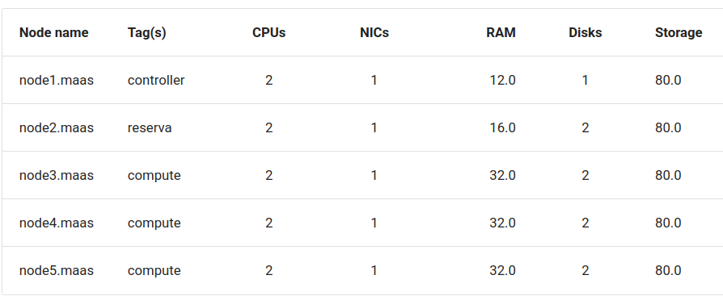
/// caption
Tabela de especificações
///

Tags – Ainda no MAAS, atribuímos as tags controller, reserva e compute de acordo com a função de cada nó.

#### 2. Verificação de rede (br-ex)

Antes de qualquer instalação, entramos na aba Networks do MAAS e garantimos que a interface br-ex estava:

- listada em todos os hosts;

- vinculada à sub-rede externa correta (gateway, máscara, DNS).

Sem esse passo, o OpenStack não conseguiria expor IPs flutuantes para fora do cluster.

#### 3. Implantação do OpenStack

Com os pré-requisitos em ordem, iniciamos a instalação do OpenStack **seguindo, passo a passo, o roteiro oficial indicado pelo professor**. Fizemos pequenas adaptações para refletir nossa topologia:

| Função      | Node | Tag      | Observação                                  |
|-------------|------|----------|---------------------------------------------|
| Controller  | 1    | `controller` | Onde o Juju Controller foi instalado |
| Reserva     | 2    | `reserva`    | Mantido livre           |
| Compute     | 3-5  | `compute`    | Hospedam os serviços OpenStack          |

> **Boa prática:** rodamos **apenas um comando por vez** e só prosseguimos quando `juju status` mostrou todos os _units_ em `active/idle`. Isso evitou conflitos de dependência entre charms.

##### 3.1 – Bootstrap (caso ainda não existisse um controller)

```bash
juju bootstrap --bootstrap-series=jammy \
               --constraints tags=controller \
               maas-one maas-controller
```
O comando acima alocou automaticamente o node 1 como Juju Controller.

##### 3.2 – Definição do modelo de deploy

```bash
juju add-model --config default-series=jammy openstack
juju switch maas-controller:openstack
```
O modelo openstack isola este ambiente de testes dos demais projetos.

##### 3.3 – Monitoramento em tempo real

Para acompanhar cada etapa sem sobrecarregar o terminal principal, abrimos um segundo shell:

```bash
watch -n 2 --color "juju status --color"
```

#### 4. Sequência de deploy dos serviços OpenStack

Abaixo está o **resumo dos comandos** que executamos — **um por vez**, sempre aguardando o `juju status` ficar totalmente `active/idle` antes de passar ao próximo serviço.

| Ordem | Serviço / Charm                       | Destino                         | Comandos principais (resumidos) |
|------:|--------------------------------------|---------------------------------|---------------------------------|
| 1 | **Ceph Mon + Ceph OSD** | `compute` (3 máquinas) |<br>`juju deploy -n 3 ceph-osd --constraints tags=compute`<br>`juju deploy -n 3 ceph-mon --to lxd:0,lxd:1,lxd:2`<br>`juju relate ceph-mon ceph-osd` |
| 2 | **MySQL InnoDB Cluster** | LXD no controller |<br>`juju deploy -n 3 mysql-innodb-cluster --to lxd:0,lxd:1,lxd:2` |
| 3 | **RabbitMQ Server** | LXD no controller |<br>`juju deploy rabbitmq-server --to lxd:0` |
| 4 | **Vault (TLS / PKI)** | LXD no controller |<br>`juju deploy vault --to lxd:1`<br>`juju relate vault mysql-innodb-cluster`<br>`juju run vault/leader generate-root-ca` |
| 5 | **Keystone** | LXD no controller |<br>`juju deploy keystone --to lxd:2`<br>`juju relate keystone mysql-innodb-cluster`<br>`juju relate keystone vault` |
| 6 | **Glance + backend Ceph** | LXD no controller + Ceph |<br>`juju deploy glance --to lxd:2`<br>`juju deploy cinder-ceph`<br>`juju relate glance ceph-mon` |
| 7 | **Nova Cloud Controller** | LXD no controller |<br>`juju deploy nova-cloud-controller --to lxd:0`<br>`juju relate nova-cloud-controller rabbitmq-server`<br>`juju relate nova-cloud-controller mysql-innodb-cluster` |
| 8 | **Nova Compute** | `compute` (3 máquinas) |<br>`juju deploy -n 3 nova-compute --to 0,1,2`<br>`juju relate nova-compute nova-cloud-controller`<br>`juju relate nova-compute ceph-mon` |
| 9 | **Neutron API & OVN Central** | LXD no controller + LXD trio |<br>`juju deploy neutron-api --to lxd:1 --config network.yaml`<br>`juju deploy -n 3 ovn-central --to lxd:0,lxd:1,lxd:2`<br>`juju deploy ovn-chassis --config network.yaml`<br>`juju relate neutron-api ovn-central`<br>`juju relate ovn-chassis nova-compute` |
| 10 | **Horizon (dashboard)** | LXD no controller |<br>`juju deploy horizon --to lxd:2`<br>`juju relate horizon keystone` |

> **Nota:** ajustamos arquivos `*.yaml` (por exemplo, `network.yaml`) para definir  
> `bridge-interface-mappings`, redes *flat* e opções de TLS.

#### 5. Neste ponto, a seção Unit exibida pelo comando juju status ficou assim:


/// caption
///

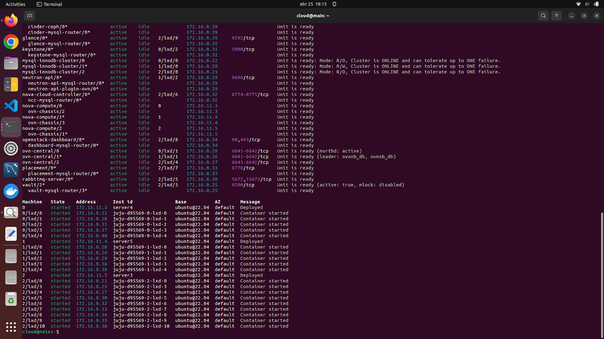
/// caption
Juju Status
///


## Setup

#### Configurando o Openstack

Nessa etapa do roteiro, nós configuramos os serviços responsáveis por controlar:

- as VMs
- os volumes de disco 
- a estrutura de rede virtual

Para isso, foi preciso:


- carregar as variáveis de ambiente e se autenticar (Keystone) no sistema - openrc;
- utilizar o dashboard (Horizon) para visualizar as mudanças que estão sendo feitas;
- importar uma imagem do Ubuntu Jammy para o Glance (servidor de imagens);
- criar os flavors (instance type) para as VMs;
- criar uma rede externa (subnet) para conectar as VMs à rede física;
- criar uma rede interna (subnet) e um roteador (router) para conectar as VMs à rede externa.

> **Nota:** utilizamos a documentação do Openstack como referência oficial para realizar os passos que estão por vir!

> https://docs.openstack.org/project-deploy-guide/charm-deployment-guide/latest/configure-openstack.html 

##### Passo 1: Autenticação

Nós criamos o arquivo **openrc**, que possui as credenciais de acesso ao OpenStack.

##### Passo 2: Horizon

Abrimos o dashboard do horizon durante todo o setup do openstack para ver as mudanças acontecendo.

A seguir estão as telas que compõe a tarefa 1:

I.

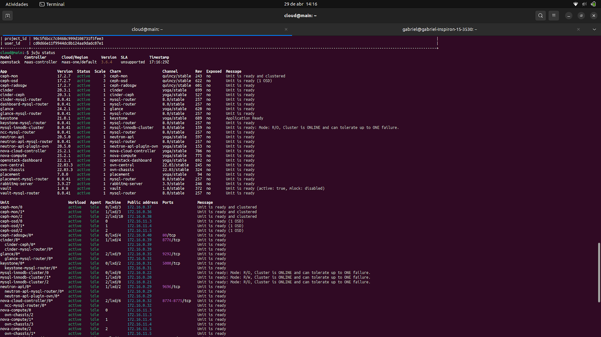
/// caption
///

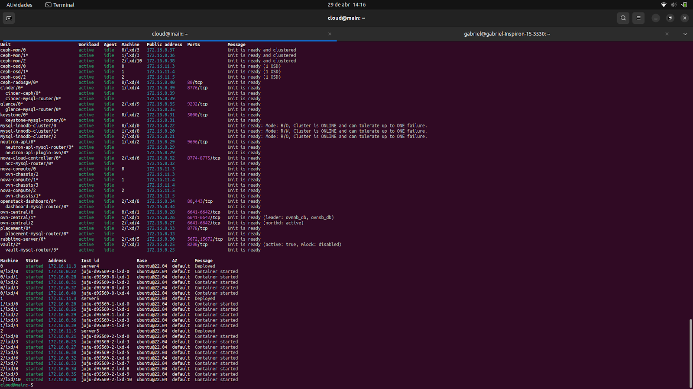
/// caption
Juju status
///

II.

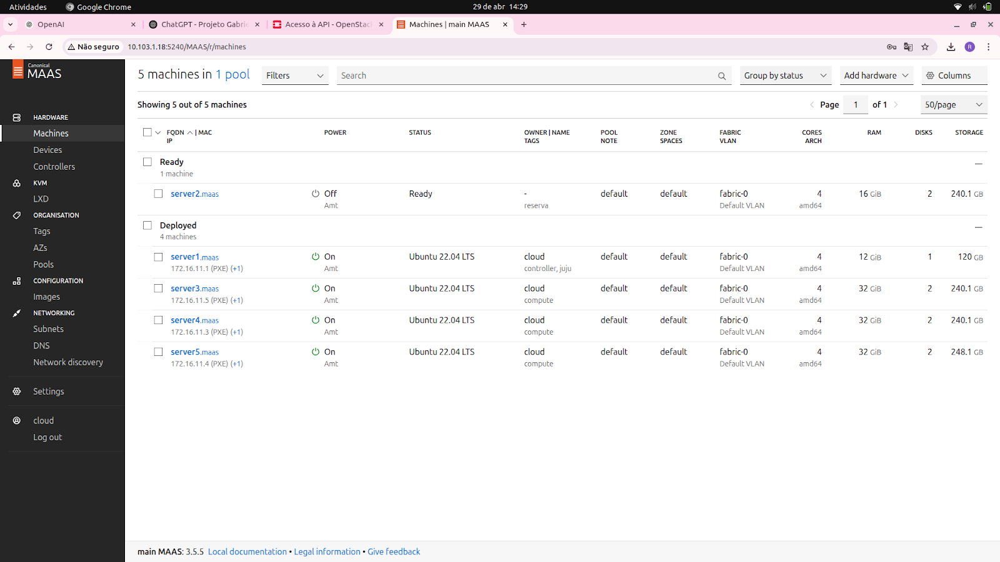
/// caption
Dashboard MAAS
///

III.

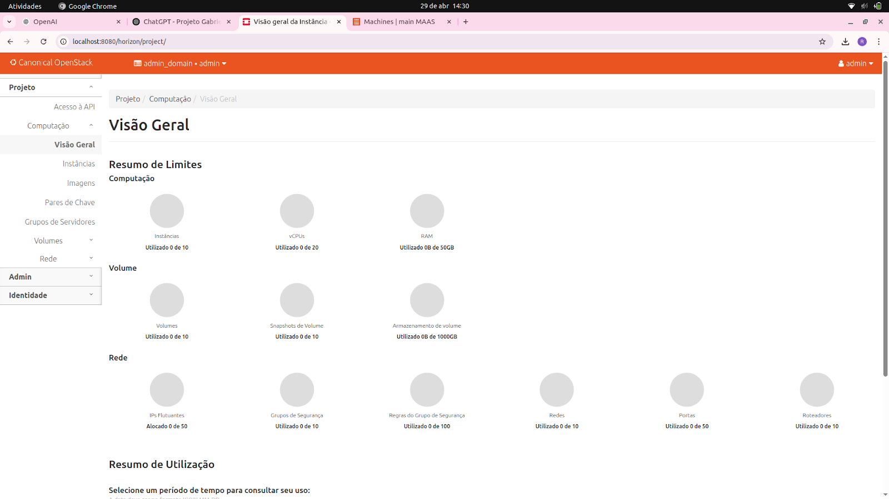
/// caption
Compute - overview
///

IV.

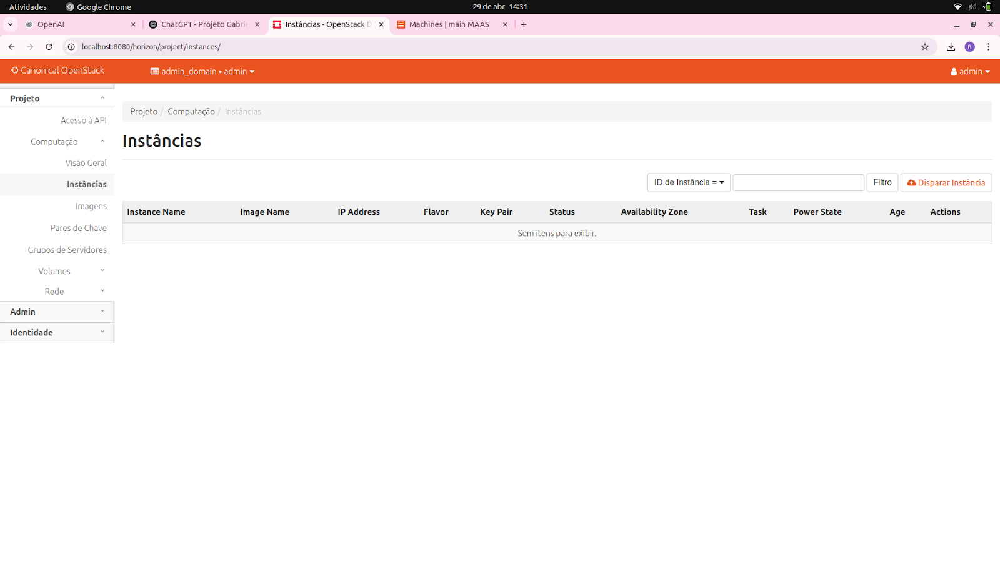
/// caption
Compute - instancias
///

V.

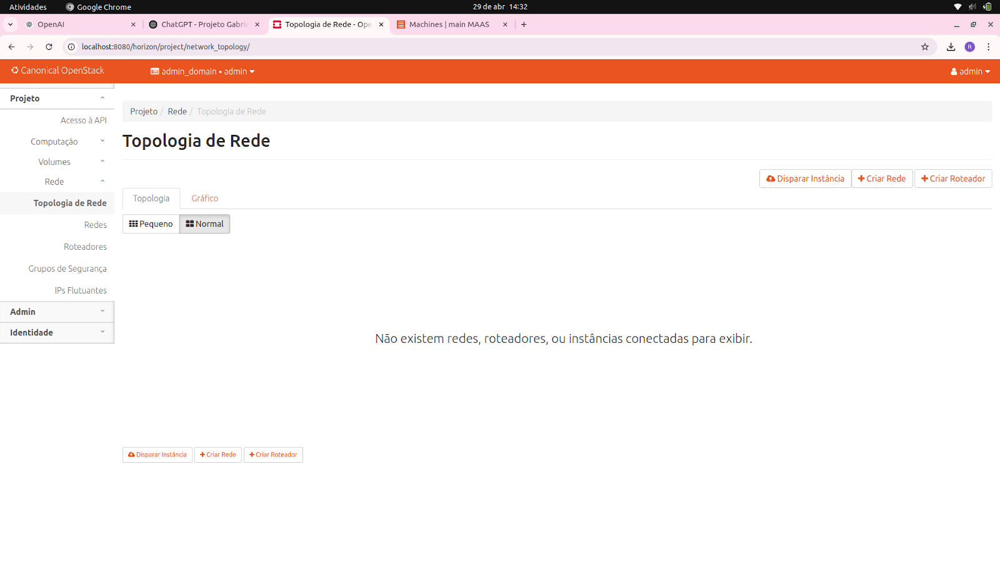
/// caption
Network - topologia de rede
///

##### Passo 3: Imagens e Flavors

Com a infraestrutura pronta, configuramos **imagens** e **flavors** para padronizar nossas VMs.

No **main**, instalamos o *client* via *snap*:

```bash
sudo snap install openstackclients
```
Carregamos as credenciais de administrador:

```bash
source ~/openrc
```

Confirmamos os serviços registrados:

```bash
openstack service list
```

Fizemos pequenos ajustes de rede, habilitando o DNS interno no Neutron/OVN:

```bash
juju config neutron-api enable-ml2-dns="true"
juju config neutron-api-plugin-ovn dns-servers="172.16.0.1"
```

Em seguida, importamos a imagem Ubuntu Jammy (22.04):

```bash
wget https://cloud-images.ubuntu.com/jammy/current/jammy-server-cloudimg-amd64.img
openstack image create "ubuntu-22.04" \
    --file jammy-server-cloudimg-amd64.img \
    --disk-format qcow2 --container-format bare --public
```

Com isso feito, pudemos criar os flavors, seguindo as requisições a seguir:

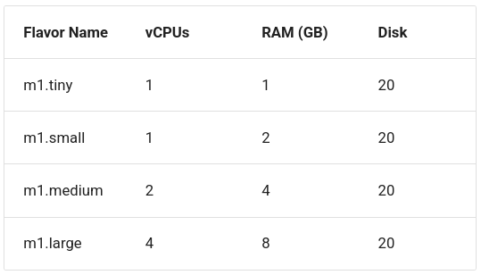
/// caption
Flavors
///

##### Passo 4: Rede Externa

Configuramos uma rede externa, utilizando uma faixa de alocação entre *172.16.7.0* e *172.16.8.255*.

##### Passo 5: Rede Interna e Roteador

Criamos a rede interna e o roteador, utilizando a subnet *192.169.0.0/24*, sem utilizar DNS.

##### Passo 6: Conexão

Importamos um key-pair, utilizando public key da máquina onde está o MAAS. Além disso, a partir do dashboard do Horizon, como administrador, adicionamos a liberação do SSH e ALL ICMP no grupo de segurança *default*.

##### Passo 7: Instância

Com os passos anteriores feitos, pudemos realizar o disparo de uma instância *m1.tiny* chamada **client** e sem novo volume. Após isso, alocamos um *floating IP* e testamos a conexão SSH, **obtendo êxito!**

A seguir estão as telas que compõe a tarefa 2:

I.

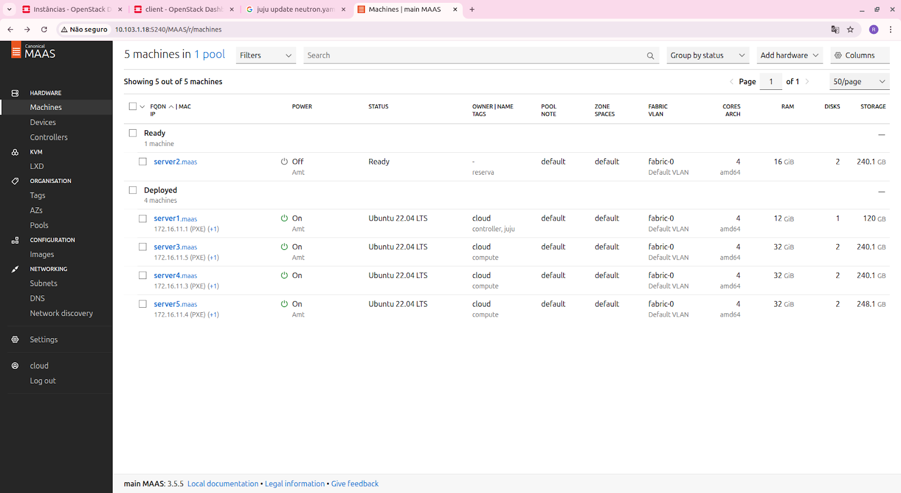
/// caption
Dashboard MAAS
///

II.

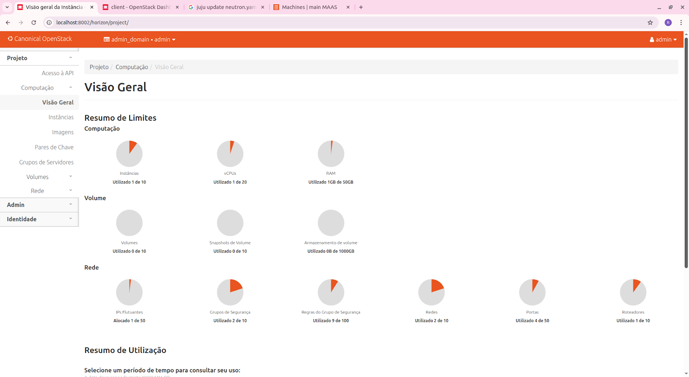
/// caption
Compute - overview
///

III.

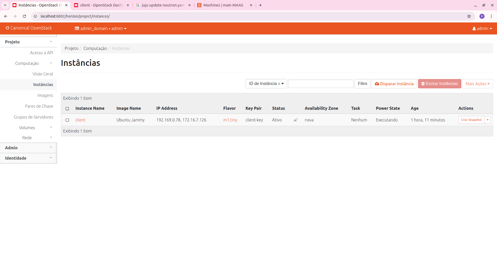
/// caption
Compute - instancias
///

IV.

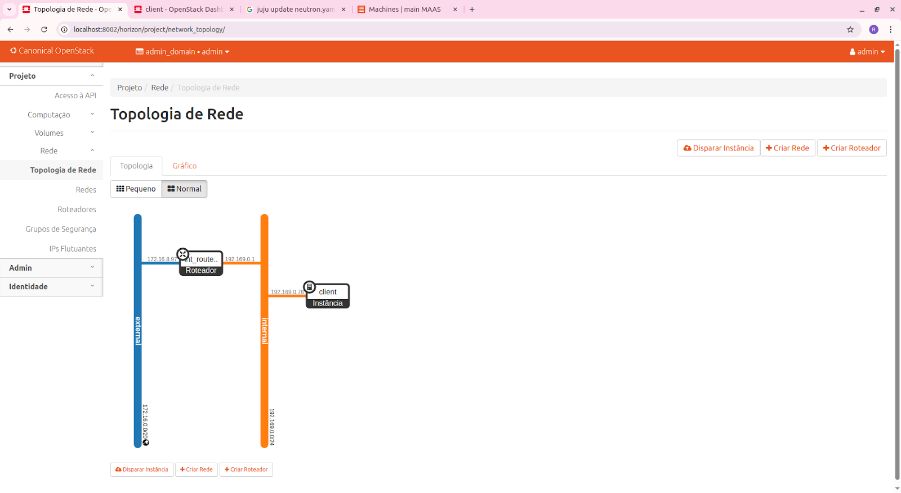
/// caption
Network - topologia de rede
///

##### Diferenças entre Tarefa 1 e Tarefa 2 — com referência ao guia oficial

| # | Tela | Alteração observada | Como o recurso foi criado (seção do guia oficial) |
|---|------|--------------------|----------------------------------------------------|
| 1 | **Compute → Overview** | Contadores mostram uso real (1 instância, 1 vCPU, 1 GB RAM, 1 IP flutuante, 2 redes, 1 roteador, 9 regras SG). | **Imagem + flavors** → seção *Create an image and flavor*.<br>**Rede externa** → seção *Set up public networking*.<br>**Rede interna + roteador** → seção *Set up private networking*.<br>**Regras de segurança** → seção *Configure SSH and security groups*. |
| 2 | **Compute → Instances** | Surgiu a VM **client** (imagem *Ubuntu Jammy*, flavor **m1.tiny**, IP interno 192.169.0.78, IP flutuante 172.16.7.126, key-pair *client-key*). | Passos da seção *Create and access an instance*. |
| 3 | **Network → Topology** | Nova topologia: rede **external**, roteador **ext_route**, rede **internal**, VM **client**. | Criado nas seções *Set up public networking* e *Set up private networking*. |
| 4 | **Security Groups** | Contador de regras foi para **9**. | Adição de SSH (22/tcp) e ALL ICMP conforme *Configure SSH and security groups*. |
| 5 | **Floating IPs** | 1 IP flutuante alocado. | Alocação e associação descritas em *Create and access an instance*. |
| 6 | **MAAS – Machines** | Nenhuma mudança nos nós bare-metal. | Alterações ocorreram apenas na camada virtual do OpenStack. |

##### Passo a passo detalhado

Os comandos abaixo reproduzem exatamente os recursos que aparecem na **Tarefa 2**. Eles seguem as seções correspondentes do guia oficial de implantação com charms ( <https://docs.openstack.org/project-deploy-guide/charm-deployment-guide/latest/configure-openstack.html> ).

###### 1 – Imagem e *flavors*  
<small>(seção *Create an image and flavor*)</small>

```bash
# Baixar a imagem cloud-init do Ubuntu Jammy
wget https://cloud-images.ubuntu.com/jammy/current/jammy-server-cloudimg-amd64.img
```
```bash
# Registrar a imagem no Glance
openstack image create "Ubuntu Jammy" \
  --file jammy-server-cloudimg-amd64.img \
  --disk-format qcow2 --container-format bare --public
```
```bash
# Criar quatro flavors
openstack flavor create m1.tiny   --ram 1024  --vcpus 1 --disk 20
openstack flavor create m1.small  --ram 2048  --vcpus 1 --disk 20
openstack flavor create m1.medium --ram 4096  --vcpus 2 --disk 20
openstack flavor create m1.large  --ram 8192  --vcpus 4 --disk 20
```
###### 2 - Rede externa (pública)
<small>(seção Set up public networking)</small>

```bash
openstack network create public-net \
  --provider-network-type flat \
  --provider-physical-network physnet1 \
  --external

openstack subnet create public-subnet \
  --network public-net \
  --ip-version 4 \
  --subnet-range 172.16.7.0/23 \
  --allocation-pool start=172.16.7.2,end=172.16.8.254 \
  --gateway 172.16.7.1 \
  --dns-nameserver 8.8.8.8
```

###### 3 - Rede interna + roteador
<small>(seção Set up private networking)</small>

```bash
openstack network create private-net

openstack subnet create private-subnet \
  --network private-net \
  --ip-version 4 \
  --subnet-range 192.169.0.0/24 \
  --gateway 192.169.0.1

openstack router create ext_route
openstack router set ext_route --external-gateway public-net
openstack router add subnet ext_route private-subnet
```

###### 4 - Regras de segurança
<small>(seção Configure SSH and security groups)</small>

```bash
openstack security group rule create default --protocol tcp  --dst-port 22
openstack security group rule create default --protocol icmp
```

###### 5 - Key-pair e IP flutuante
<small>(seção Create and access an instance)</small>

```bash
openstack keypair create --public-key ~/.ssh/id_rsa.pub client-key

FIP=$(openstack floating ip create -f value -c floating_ip_address public-net)
```

###### 6 - Instância client
<small>(seção Create and access an instance)</small>

```bash
openstack server create client \
  --image "Ubuntu Jammy" \
  --flavor m1.tiny \
  --key-name client-key \
  --network private-net

openstack server add floating ip client "$FIP"
```

#### Escalando os nós

Adicionar novos nós de **computação** e **block storage** ao cluster OpenStack é o caminho mais simples e econômico para crescer horizontalmente:

* **Maior capacidade** – mais vCPUs e RAM disponíveis para lançar VMs simultâneas.  
* **Alta disponibilidade** – a carga se redistribui caso um nó falhe, reduzindo impacto.  
* **Menor latência** – dados e processos ficam mais próximos das VMs que consomem esses recursos.  
* **Escalabilidade horizontal** – em vez de turbinar um único host (vertical), adicionamos máquinas menores, fácil de automatizar e balancear com Nova + Ceph.

##### O que fizemos

- **Liberar o nó reserva no MAAS**  
    * Dashboard → *Machines* → seleção da máquina `ALLOCATED` → **Release** (sem apagar tags).

-  **Adicionar o nó como hypervisor** (`nova-compute`):

    ```bash
    juju add-unit nova-compute
    ```
   
- **Após rodar juju status, anotamos o machine-id mostrado para o novo unit**.

- **Em seguida, instalamos o *block storage***:

    ```bash
    juju add-unit --to <machine-id> ceph-osd
    ```

Com isso, o antigo “nó reserva” passou a contribuir tanto com poder de processamento quanto com discos, ampliando a capacidade e a resiliência da nuvem.

A seguir está a nossa arquitetura de rede que compõe a tarefa 3:

<div style="text-align: center;">
  ```mermaid
  flowchart TB
      %% Internet “real”
      internet_real[Internet]
      internet_real e4@==>|Upstream| insper
      e4@{ animate: true }

      %% Roteador INSPer
      insper[Roteador Insper<br>LAN: 10.103.0.1]
      insper e5@==>|WAN 10.103.1.18| kit
      e5@{ animate: true }

      %% Roteador KIT
      kit[Roteador KIT<br>WAN: 10.103.1.18]
      kit e6@==>|Rede VM 172.16.0.0/20| internet_vm
      e6@{ animate: true }

      %% Internet VM e Roteador VM
      internet_vm[Internet VM]
      internet_vm e1@==>|request<br>172.16.0.0/20| router_vm
      e1@{ animate: true }

      router_vm[Roteador VM<br>Ext: 172.16.8.97<br>Int: 192.169.0.1]
      router_vm e2@==>|192.169.0.1| client
      e2@{ animate: true }

      %% Cliente
      client[Client<br>192.169.0.78]

  ``` 
</div>

## APP

Nessa parte final do roteiro, nós nos dedicamos a levantar algumas aplicações em máquinas virtuais do Openstack.

Em duas VMs, nós colocamos a nossa API do projeto 1, em uma terceira, colocamos o PostgreSQL, para servir como banco de dados e, por fim, em uma quarta, colocamos o Nginx para servir como load balancer de acesso às VMs que continham a API.

### Passo a passo

- Para começar, instanciamos as VMs, associamos os floating IPs e definimos os grupos de segurança de cada uma.

- Em seguida, instalamos o docker em cada uma das VMs, utilizando os seguintes comandos:

```bash
sudo apt update
sudo apt install -y ca-certificates curl gnupg lsb-release

sudo mkdir -p /etc/apt/keyrings
curl -fsSL https://download.docker.com/linux/ubuntu/gpg \
  | sudo gpg --dearmor -o /etc/apt/keyrings/docker.gpg

echo \
  "deb [arch=$(dpkg --print-architecture) signed-by=/etc/apt/keyrings/docker.gpg] \
    https://download.docker.com/linux/ubuntu \
    $(lsb_release -cs) stable" \
  | sudo tee /etc/apt/sources.list.d/docker.list

sudo apt update
sudo apt install -y docker-ce docker-ce-cli containerd.io

sudo systemctl enable --now docker
```

- Nas VMs da API, nós precisamos puxar nossa imagem do docker hub com o seguinte comando:

```bash
sudo docker pull Luizatac/projeto_cloudi-app:cloudi
```

- Para rodar a imagem do docker hub, nós utilizamos:

```bash
docker run -d --name api \
  -e POSTGRES_DB=projeto \
  -e POSTGRES_USER=projeto \
  -e POSTGRES_PASSWORD=projeto \
  -e JWT_SECRET_KEY=secret \
  -e JWT_ALGORITHM=HS256 \
  -e DB_HOST=192.169.0.27 \
  -p 8080:8080 \
  --restart unless-stopped \
  luizatac/projeto_cloud1-app:cloud1
```

- Na VM do database, nós precisamos puxar a imagem do postgre com o seguinte comando:

```bash
sudo docker pull postgres:17
```

- Criamos um volume:

```bash
docker volume create pgdata
```

- E rodamos a imagem:

```bash
docker run -d --name postgres \
  -e POSTGRES_DB=projeto \
  -e POSTGRES_USER=projeto \
  -e POSTGRES_PASSWORD=projeto \
  -v pgdata:/var/lib/postgresql/data \
  -p 5432:5432 \
  --restart unless-stopped \
  postgres:17
```

- Em seguida, partimos para a VM do load balancer. Nela, realizamos a instalação do Nginx:

```bash
sudo apt-get install nginx
```

- Adicionamos as configurações de balanceamento de carga ao arquivo */etc/nginx/sites-available/default*:

```bash
upstream backend {
    server 192.169.0.130:8080;   # api1
    server 192.169.0.62:8080;    # api2
}
```

- Depois, referenciamos o módulo na configuração e reiniciamos o nginx:

```bash
server { location / { proxy_pass http://backend; } }
```
```bash
sudo service nginx restart
```

- Por fim, tivemos que realizar a abertura das portas da API:

    - O grupo de segurança **default** do OpenStack bloqueia todo tráfego de entrada por padrão.  
Quando subimos as VMs `api1` e `ap2`, percebemos que nem o Nginx nem um cliente externo conseguiam alcançar a porta **8080**. Para permitir o balanceamento e os testes iniciais, adicionamos uma regra de segurança liberando essa porta para qualquer origem.

Com tudo isso feito, bastou realizarmos um túnel, a partir da nossa máquina, via main, para o load balancer. 

```bash
ssh cloud@10.103.1.18 -L 8003:172.16.8.140:80
```

Depois de estabelecer o túnel, o navegador local acessa
http://localhost:8003/ e a requisição atravessa o SSH até o Nginx, que distribui entre api1 e ap2.

A seguir estão as telas que compõe a tarefa 4:

I.

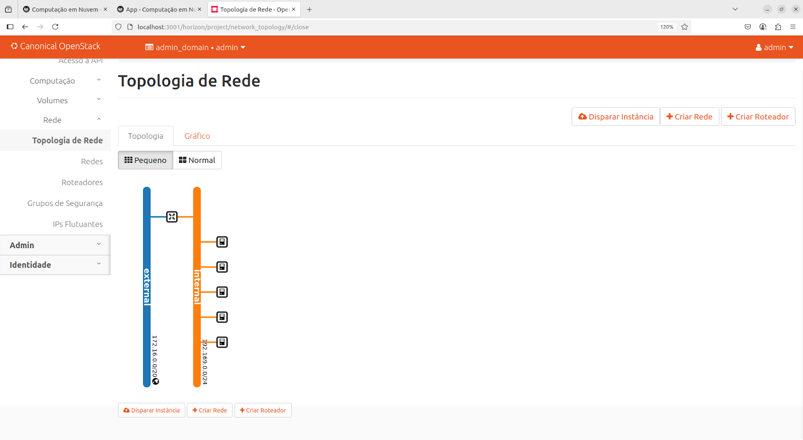
/// caption
Arquitetura de rede
///

II.

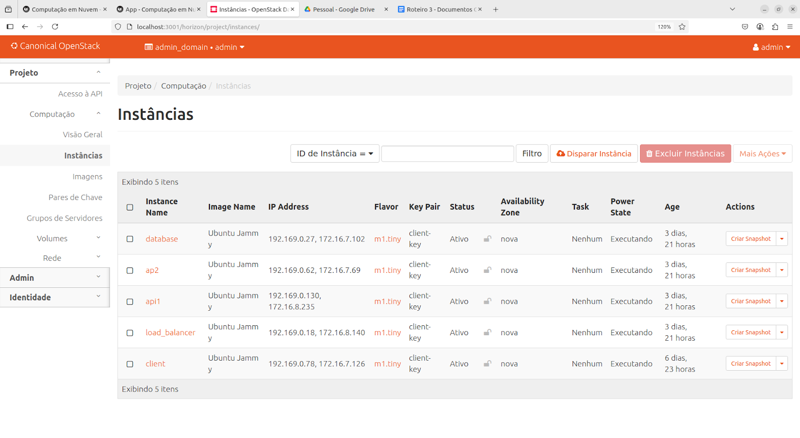
/// caption
Lista de VMs
///

III. 

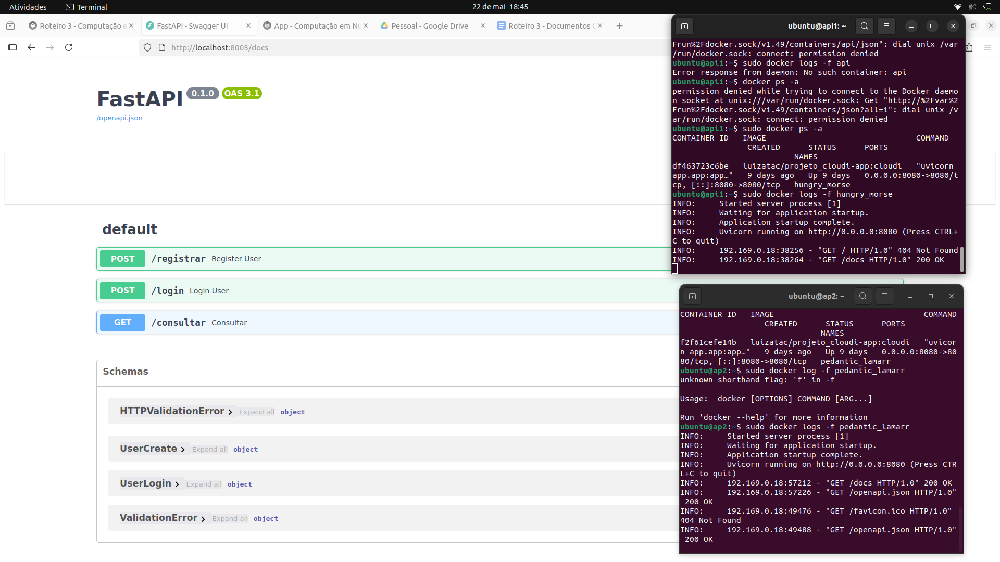
/// caption
Dashboard Fast API
///

IV.

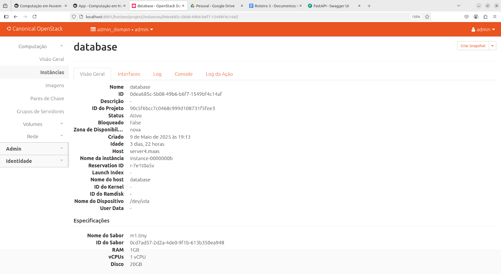
/// caption
Instância 1
///


/// caption
Instância 2
///

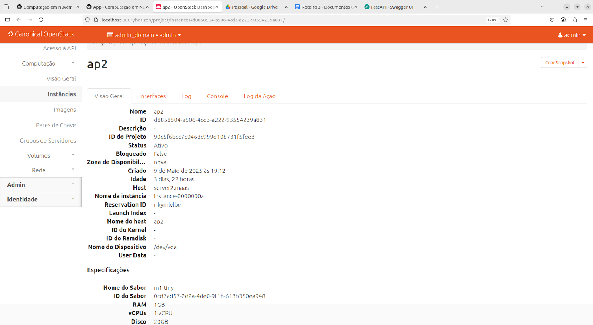
/// caption
Instância 3
///

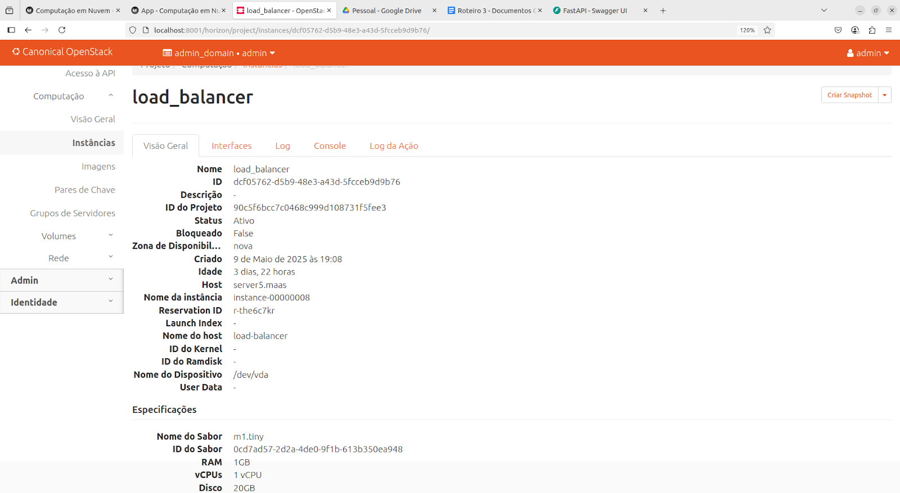
/// caption
Instância 4
///