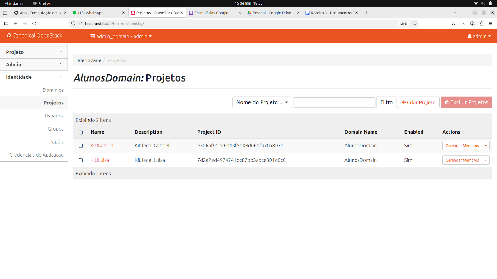
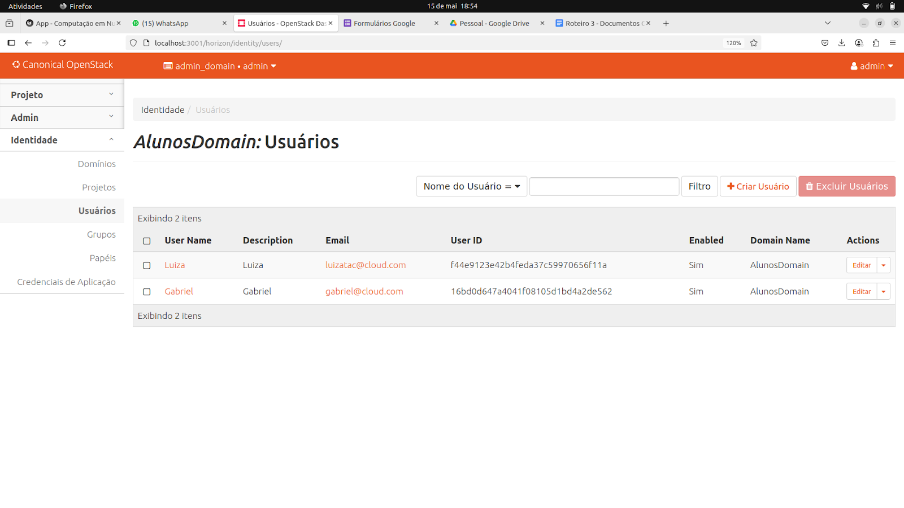
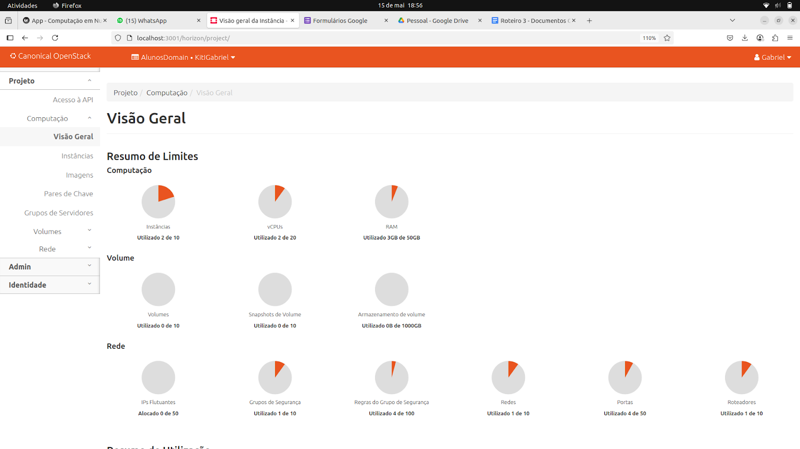
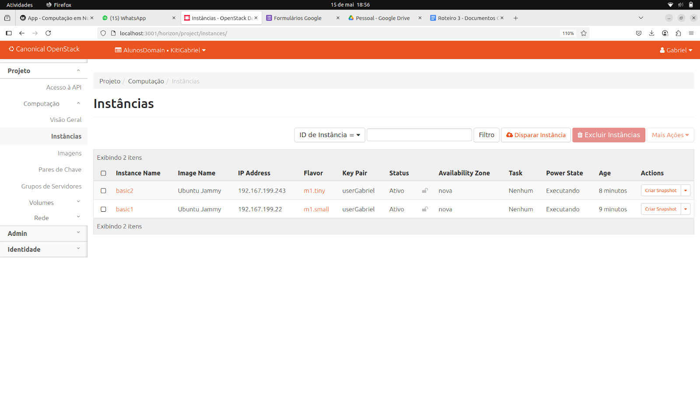
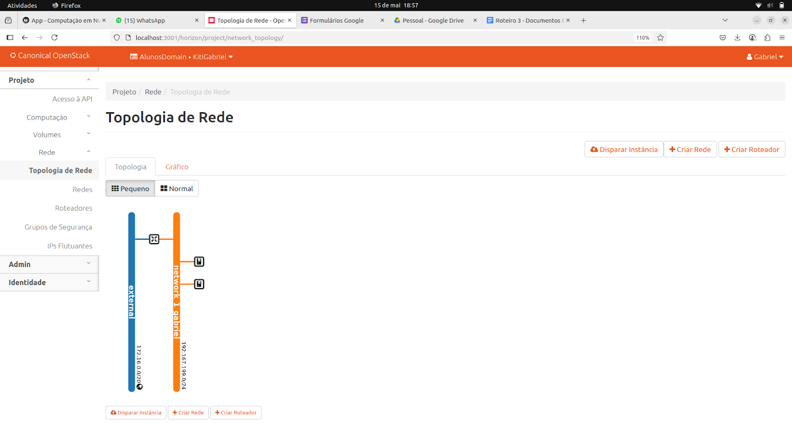
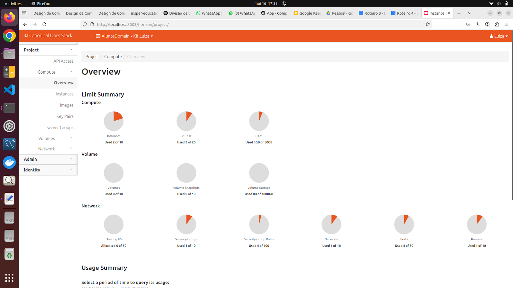
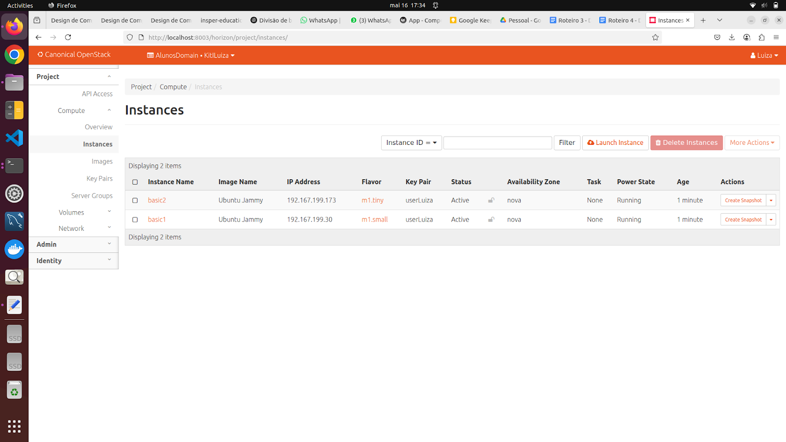
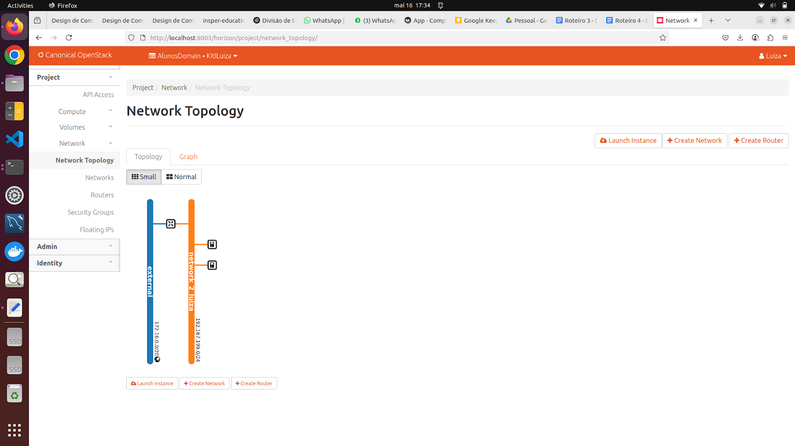

# Objetivo

O objetivo do quarto roteiro é apresentar os conceitos básicos de Infraestrutura como Código (IaC), Acordo de Nível de Serviço (SLA) e Recuperação de Desastres (DR). 

Para isso, o roteiro foi dividido em quatro partes principais: entender IaC e sua visão geral; criar a hierarquia de projetos; construir a infraestrutura utilizando IaC, aplicando os conceitos aprendidos; e, por fim, subir uma aplicação individual por aluno.

??? IaC

    **VISÃO GERAL** 

    Infraestrutura como Código (IaC) permite gerenciar e provisionar infraestrutura por meio de arquivos de configuração, garantindo consistência, repetibilidade e controle de mudanças. Evita erros manuais e facilita a criação de ambientes padronizados. 
    
     * **Indopetêcia** > a capacidade de uma determinada operação produzir sempre o mesmo resultado. Garantindo que o ambiente final sempre esteja conforme o definido no código. 
     
    O Terraform é uma das principais ferramentas IaC, usada para declarar e gerenciar recursos em diferentes plataformas de nuvem com eficiência e rastreabilidade. ]
    
    Para implementar uma infaestrutura com o Terraform :

        :zap: Para implantar infraestrutura com o Terraform:

            * Scope         - Identifique a infraestrutura para o seu projeto.
            * Author        - Escreva a configuração para sua infraestrutura.
            * Initialize    - Instale os plugins que o Terraform precisa para gerenciar a infraestrutura.
            * Plan          - Visualize as alterações que o Terraform fará para corresponder à sua configuração.
            * Apply         - Faça as alterações planejadas.

    * Para instalar o Terraform foi utilizado os seguintes comandos de código:

    === "Ubuntu/Debian"

        * `wget -O- https://apt.releases.hashicorp.com/gpg | gpg --dearmor | sudo tee /usr/share/keyrings/hashicorp-archive-keyring.gpg`
        * `gpg --no-default-keyring --keyring /usr/share/keyrings/hashicorp-archive-keyring.gpg --fingerprint`
        * `echo "deb [signed-by=/usr/share/keyrings/hashicorp-archive-keyring.gpg] https://apt.releases.hashicorp.com $(lsb_release -cs) main" | sudo tee /etc/apt/sources.list.d/hashicorp.list`
        * `sudo apt update && sudo apt install terraform`
    
## Estrutura de Gestão de Projetos OpenStack

O **OpenStack** é uma plataforma de nuvem de código aberto que oferece infraestrutura como serviço (IaaS) e é gerenciada por ferramentas como **MAAS** e **JUJU**. Dentro do OpenStack, o gerenciamento de identidade e acesso é feito através do **Keystone**, que organiza recursos e usuários em **Domains**, **Projects**, **Users**, **Groups** e **Roles**.


**1.Domains** são unidades hierárquicas para organizar e isolar recursos e usuários. Representam diferentes organizações ou departamentos dentro do OpenStack.

**2.Projects** são unidades que agrupam recursos, como máquinas virtuais, redes e armazenamento. Eles facilitam o gerenciamento de custos, segurança e quotas de recursos, funcionando como departamentos ou times dentro de uma organização.

**3.Users** representam contas de pessoas, sistemas ou serviços que gerenciam ou utilizam os recursos na nuvem. Eles podem ter permissões variáveis em um ou mais projetos, dependendo das **Roles** atribuídas.

**4.Groups** são coleções de usuários. Eles permitem o gerenciamento de permissões de acesso de forma centralizada, facilitando a aplicação de regras e políticas para múltiplos usuários simultaneamente.

**5.Roles** definem as permissões de acesso que um usuário ou grupo tem sobre os recursos e operações dentro do OpenStack. Exemplos incluem o **role** de "admin", que tem permissões completas, e **roles** mais restritos que limitam o acesso.

Esses conceitos trabalham juntos dentro do **Keystone** para fornecer um sistema robusto de **Gerenciamento de Identidade e Acesso (IAM)**, oferecendo uma administração eficaz dos recursos de nuvem em ambientes complexos e multi-tenant.

--------------------------------------------------------


# Infra

Para desenvolver o roteiro foi necessário a realização de criação de um domínio, dois projetos (um para cada aluno) e um usuário "Aluno" em cada projeto no OpenStack via Horizon Dashboard (a interface web do OpenStack). Após a criação de todos esses itens foi iniciado a construção da infraestrutura.

---------------------------------------------------------

# App

## Criando a Infraestrutura utilizando IaC (Terraform)

O **Terraform** utiliza arquivos com extensão `.tf` para definir a infraestrutura desejada como código (IaC).

- O **estado da infraestrutura** é registrado no arquivo `terraform.tfstate`.
  - Por padrão, este arquivo é salvo **localmente**.
  - Pode também ser salvo **remotamente** para facilitar o trabalho em equipe.

- Os **provedores** (ex: OpenStack, AWS, Azure, etc) são configurados geralmente no arquivo `provider.tf`.

A estrutura básica deve seguir o seguinte padrão:

```
terraform/
  ├── instance.tf          
  ├── network.tf              
  ├── provider.tf         
  └── router.tf

```

Divisão de arquivos:

provider.tf
```
terraform {
required_version = ">= 0.14.0"
  required_providers {
    openstack = {
      source  = "terraform-provider-openstack/openstack"
      version = "~> 1.35.0"
    }
  }
}

provider "openstack" {
  user_name   = "Luiza"
  password    = "12345"
  auth_url    = "https://172.16.0.31:5000/v3"
  region      = "RegionOne"
  insecure    = true
}

```

instance1.tf
```
resource "openstack_compute_instance_v2" "basic1" {
  name       = "basic1"
  image_id   = "1c516c38-150c-4090-9a1f-fbc5a0c9701a"
  flavor_id  = "abdac55e-15b8-4201-8e27-832d64c43886"
  key_pair   = "userLuiza"

  network {
    uuid = openstack_networking_network_v2.network_2_luiza.id
  }
}
```

instance2.tf
```
resource "openstack_compute_instance_v2" "basic2" {
  name       = "basic2"
  image_id   = "1c516c38-150c-4090-9a1f-fbc5a0c9701a"
  flavor_id  = "0cd7ad57-2d2a-4de0-9f1b-613b350ea948"
  key_pair   = "userLuiza"

  network {
    uuid = openstack_networking_network_v2.network_2_luiza.id
  }
}

```


network.tf
```
resource "openstack_networking_network_v2" "network_2_luiza" {
  name           = "network_2_luiza"
  admin_state_up = true
}

resource "openstack_networking_subnet_v2" "subnet_2" {
  network_id = openstack_networking_network_v2.network_2_luiza.id
  cidr       = "192.167.199.0/24"
  ip_version = 4
}
```


router.tf
```
resource "openstack_networking_router_v2" "router_2" {
  name                = "user2_router"
  admin_state_up      = true
  external_network_id = "1269cbdf-837a-4da5-a372-f5512406cb78"
}

resource "openstack_networking_router_interface_v2" "int_2" {
  router_id = openstack_networking_router_v2.router_2.id
  subnet_id = openstack_networking_subnet_v2.subnet_2.id
}
```
!!! danger "Atenção"

    **Os códigos acima são referentes a apenas um dos alunos. Cada aluno realizou, em sua própria pasta, as criações e alterações necessárias em cada arquivo.**


Após a criação dos arquivos foi realizado o processo de credenciamento de usuários, para isso foi realizado o seguinte processo:

* 1.Acesso no dashboard com o login do seu usuario

* 2.Download do openstack rc file do seu usuário

* 3.Upload do arquivo na máquina

* 4.Permissão de execução para o arquivo chmod +x arquivo.sh

* 5.Carregando as variaveis de ambiente do seu usuário source arquivo.sh

Para fazer a implementação da infraestrutura, foi executado os comandos abaixo:

```bash
terraform plan
``` 

* Utilizado para criar um plano de execução

```bash
terraform apply
```

* Aplica as mudanças necessárias para alcançar o estado desejado da sua configuração. Ele cria, atualiza ou destrói os recursos conforme necessário.

---------------------------------------------------

Abaixo seguem as imagens do Dashboard do Openstack com os identy Projects e Users.


///caption
Identy Projects (Admin)
///


///caption
Identy Projects (Admin)
///


!!! note "Checkpoint Gabriel"


    
    ///caption
    Aba compute overview no OpenStack
    ///


    
    ///caption
    Aba compute instances no OpenStack
    ///


    
    ///caption
    Aba compute topology no OpenStack
    ///


!!! note "Checkpoint Luiza"


    
    ///caption
    Aba compute overview no OpenStack
    ///


    
    ///caption
    Aba compute instances no OpenStack
    ///


    
    ///caption
    Aba compute topology no OpenStack
    ///


## Criando um plano de Disaster Recovery e SLA

!!! exercise
    I. **Você escolheria Public Cloud ou Private Cloud?**

      Para a implantação de um sistema crítico, com dados sigilosos e necessidade de baixo custo, a escolha mais adequada é a **Private Cloud**. Essa opção oferece maior controle sobre a segurança, redes, armazenamento e políticas internas, além de garantir conformidade com leis como a LGPD. Apesar do custo inicial mais alto em relação à nuvem pública, a nuvem privada garante maior confiabilidade, personalização e isolamento dos dados.

    II. **Agora explique para ao RH por que você precisa de um time de DevOps**

      Uma equipe DevOps permite a automação de processos, como deploys e testes, reduzindo falhas humanas e acelerando o ciclo de entrega. Além disso, o DevOps promove a integração contínua (CI) e entrega contínua (CD), facilitando atualizações rápidas e seguras. Essa equipe também é responsável por monitorar o ambiente, aplicar correções de forma proativa e garantir a disponibilidade dos serviços. 

    III. **Considerando o mesmo sistema crítico, agora sua equipe deverá planejar e implementar um ambiente resiliente e capaz de mitigar possíveis interrupções/indisponibilidades.** 

      Para garantir resiliência e continuidade do sistema crítico, elaboramos um plano de recuperação de desastres (DR) e alta disponibilidade (HA), estruturado da seguinte forma:

      As ameaças identificadas incluem: quedas de energia nos data centers, falhas de hardware, ataques cibernéticos (como ransomware e DDoS), erros humanos durante atualizações e desastres naturais como enchentes ou incêndios. Cada uma dessas ameaças pode comprometer a operação e a disponibilidade dos serviços.

      As principais ações para a recuperação do ambiente incluem a criação de um inventário de ativos críticos, scripts de automação para restaurar serviços, documentação clara de todos os procedimentos e o uso de uma infraestrutura redundante em um local secundário. A realização periódica de testes de recuperação também é essencial para garantir a eficácia do plano.

      Os dados serão protegidos por meio de uma política de backup que contempla cópias incrementais diárias e completas semanais. Os backups serão armazenados de forma redundante, com cópias locais e externas (em outra região ou data center), todos criptografados. Testes regulares de restauração serão realizados para validar a integridade dos dados. A política de retenção será definida conforme a criticidade das informações, garantindo a preservação dos dados mais sensíveis por períodos maiores.

      Para garantir alta disponibilidade, a infraestrutura contará com clusters de servidores balanceados por soluções como HAProxy, além de bancos de dados replicados em tempo real. Os serviços críticos serão executados em containers, com múltiplas réplicas gerenciadas por Kubernetes. O ambiente contará com monitoramento contínuo por ferramentas como Prometheus e Grafana, além de mecanismos de auto-escalonamento. Em caso de falha, o sistema será capaz de redirecionar automaticamente o tráfego para instâncias saudáveis por meio de DNS failover.

